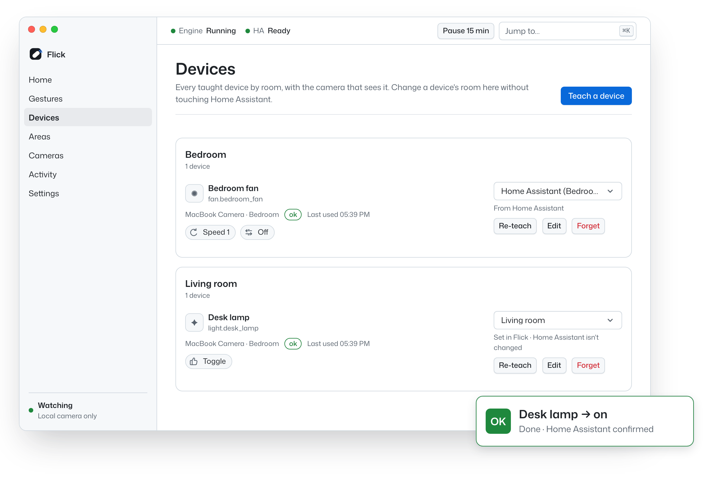
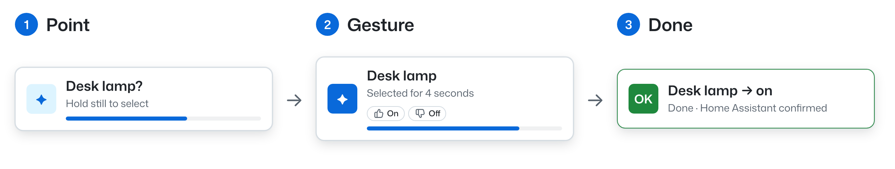
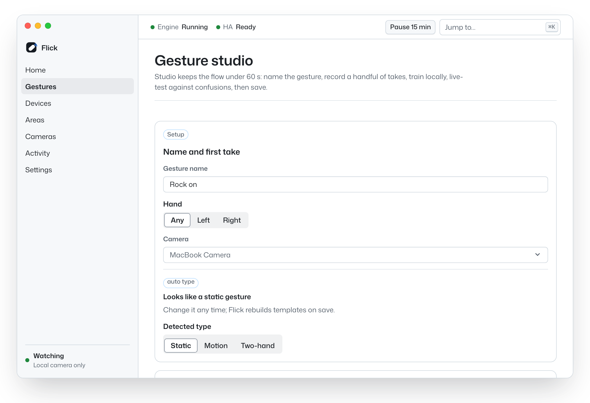
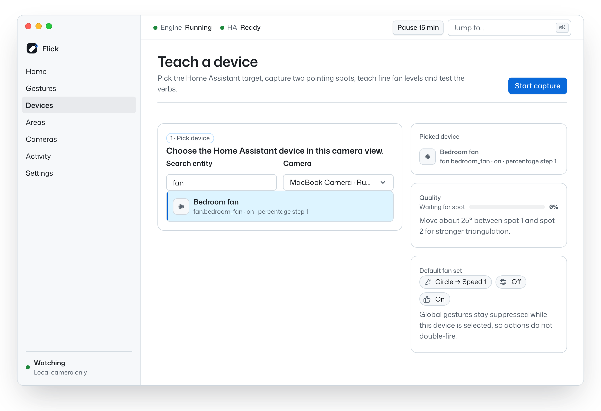
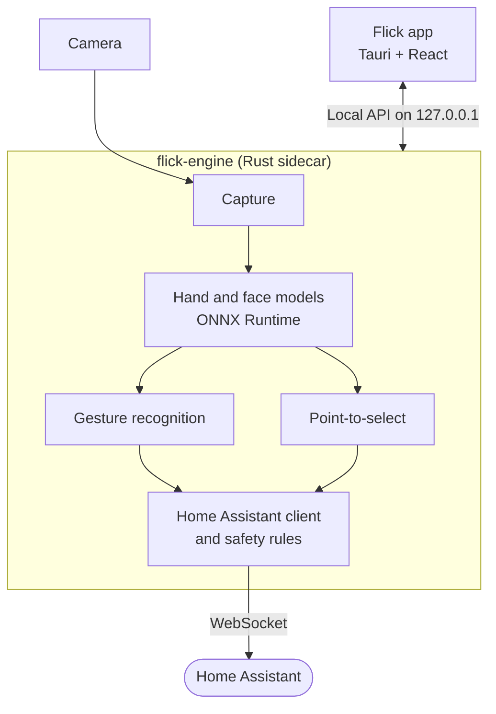

<p align="center">
  
</p>

<h1 align="center">Flick</h1>

<p align="center">
  <strong>Point at a lamp. Give it a thumbs up. It turns on.</strong>
</p>

<p align="center">
  Flick turns the camera you already own into a private, instant remote for <a href="https://www.home-assistant.io">Home Assistant</a>.<br>
  It runs entirely on your Mac.
</p>

<p align="center">
  <a href="https://github.com/joselcaguilar/flick/actions/workflows/codeql.yml"></a>
  <a href="LICENSE"></a>
  
  
  
</p>

<p align="center">
  <a href="#how-it-works">How it works</a> ·
  <a href="#features">Features</a> ·
  <a href="#privacy">Privacy</a> ·
  <a href="#getting-started">Getting started</a> ·
  <a href="#roadmap">Roadmap</a> ·
  <a href="#contributing">Contributing</a>
</p>

<picture>
  <source media="(prefers-color-scheme: dark)" srcset="docs/assets/readme/hero-dark.png">
  
</picture>

> [!NOTE]
> Flick is early (v0.1.0) and there's no signed download yet. You can [build it from source](#build-the-app) on an Apple silicon Mac, or [try the interface](#try-the-interface) with sample data first.

## Why Flick?

- **Point, don't scroll.** No phone to unlock, no dashboard to dig through, no wake word to say. Point at the thing and make a gesture.
- **Designed for access first.** Flick is built first for people with limited mobility or speech and for Deaf and hard-of-hearing people, for whom voice assistants often fail. Use the gestures that suit your body, or teach your own from a handful of takes.
- **Private by design.** Video is processed on your Mac and never leaves it. Flick keeps hand-landmark geometry, never images.

## How it works

<picture>
  <source media="(prefers-color-scheme: dark)" srcset="docs/assets/readme/how-it-works-dark.png">
  
</picture>

1. **Point.** Flick follows a line from your eyes through your index fingertip to a device you've taught it. Hold still for a moment to select it.
2. **Gesture.** The device stays selected for four seconds. Make the gesture you mapped to it, like a thumbs up for on or a thumbs down for off.
3. **Done.** Flick calls Home Assistant, and the HUD confirms once Home Assistant does. Sounds are optional.

Not everything needs a point. A global gesture always controls the same device, and room gestures work whenever you aren't pointing at anything.

## Features

- **Point-to-select.** Teach a device by pointing at it from two spots about 25° apart, and Flick triangulates where it is. No markers or tags.
- **Built-in gestures.** Fist, open palm, pointing up, thumbs up and down, victory, I-love-you, swipes in four directions, circles, pulling two hands apart, and a pinch dial for levels like brightness.
- **Gesture Studio.** Teach your own static, motion or two-hand gestures, for either hand or a specific one. Record a handful of takes and Flick trains the gesture on your Mac.
- **Rooms, scenes and scripts.** Room gestures switch a whole room on or off or run your Home Assistant scenes and scripts. Changing a room in Flick never edits Home Assistant.
- **Safe by default.** Locks, alarm panels, valves, sirens, garage doors, doors, gates, and shell or REST commands stay blocked until you allow them, and then still need a confirmation gesture (a thumbs up by default). Frame voting and cooldowns help keep stray movements from triggering actions.
- **Always in the loop.** An always-on-top HUD shows what's selected and what happened, with optional sounds and an Activity log. Pause Flick from the menu bar for 15 minutes, an hour, or until you resume.
- **Smart connection.** Flick talks to Home Assistant over its WebSocket API, picks your internal or external URL based on trusted Wi-Fi networks, and supports client certificates (mTLS).
- **Accessible and themeable.** Six Primer themes, including two high-contrast themes and one for protanopia and deuteranopia, or follow your system. Works with the keyboard and targets WCAG 2.2 AA.

<details>
<summary><strong>More screenshots</strong></summary>
<br>

**Gesture Studio.** Name a new gesture, pick the hand, and choose static, motion or two-hand.

<picture>
  <source media="(prefers-color-scheme: dark)" srcset="docs/assets/readme/studio-dark.png">
  
</picture>

**Teach a device.** Pick a Home Assistant entity and a camera, then point at the device from two spots.

<picture>
  <source media="(prefers-color-scheme: dark)" srcset="docs/assets/readme/teach-dark.png">
  
</picture>

<sub>Screenshots show sample data.</sub>

</details>

## Privacy

Flick is local-first: no account, no cloud service and no telemetry.

- Camera frames are processed on your Mac and never leave it. Flick stores hand-landmark geometry, never images.
- Flick only connects to your Home Assistant, plus update checks you start yourself.
- The engine's API listens on 127.0.0.1 only, behind a token that changes on every launch.
- Your Home Assistant token is stored in the macOS Keychain.

## Getting started

You'll need:

- A Mac with Apple silicon, running macOS 13 Ventura or later
- A camera: built-in, USB or Continuity Camera
- Home Assistant and a [long-lived access token](https://developers.home-assistant.io/docs/auth_api/#long-lived-access-token)
- To build: Xcode Command Line Tools, [Rust](https://rustup.rs) (the pinned toolchain installs itself), Node.js 26 with pnpm, and Python 3.12 for a one-time model conversion

```sh
git clone https://github.com/joselcaguilar/flick.git
cd flick
pnpm --dir ui install
```

### Try the interface

Explore every screen with sample data. No camera or Home Assistant needed.

```sh
pnpm --dir ui dev:mock
```

Then open <http://127.0.0.1:5173>.

### Build the app

```sh
# Models: download the hand and face models (SHA-256 verified), then convert MediaPipe's gesture model
cargo xtask fetch-models
python3.12 -m venv tools/training/.venv
source tools/training/.venv/bin/activate
pip install tensorflow==2.21.0 tf2onnx==1.17.0 onnx==1.23.0 numpy==2.5.3 protobuf==7.36.2 flatbuffers==25.12.19
python tools/training/convert.py fetch gesture_recognizer_task
python tools/training/convert.py convert-gesture
deactivate

# App: build an ad-hoc signed debug bundle and open it
pnpm --dir apps/desktop install
pnpm --dir apps/desktop bundle:local
open target/debug/bundle/macos/Flick.app
```

On first launch, Flick walks you through camera access, connecting Home Assistant, your first flick, teaching a device, and the controls that keep you in charge. Model and signing details are in [apps/desktop/README.md](apps/desktop/README.md).

## Under the hood

Flick is a [Tauri 2](https://tauri.app) app with a React 19 interface. The perception work happens in `flick-engine`, a Rust sidecar that reads the camera, runs hand and face models on [ONNX Runtime](https://onnxruntime.ai), recognizes gestures, works out what you're pointing at, and calls Home Assistant. The app talks to the engine over a local API on 127.0.0.1.



| Path | What lives there |
| --- | --- |
| `apps/desktop` | Tauri shell: window, menu bar item, HUD and updater |
| `ui` | Interface built with React 19, Vite, Tailwind CSS v4 and Radix UI |
| `crates/flick-engine` | The sidecar binary that ties the crates together |
| `crates/flick-capture` | Camera capture workers and frame sources |
| `crates/flick-vision` | Hand and face perception on ONNX Runtime |
| `crates/flick-gestures` | Gesture recognition, replay and training |
| `crates/flick-spatial` | Pointing rays and device targeting |
| `crates/flick-ha` | Home Assistant client, service calls and safety rules |
| `crates/flick-api` | Local REST, WebSocket and MJPEG preview API, with OpenAPI |
| `crates/flick-store` | SQLite storage, migrations and retention |
| `crates/flick-update` | Signed update metadata and pack verification |
| `crates/flick-core` | Shared domain types, config and errors |
| `models` | Pinned model sources and SHA-256 checksums |
| `tools/training` | Model conversion scripts |
| `xtask` | Developer tasks such as `cargo xtask fetch-models` |

## Roadmap

Phase 1, the macOS MVP, is built apart from signed releases and live updates.

- [x] Point-to-select with two-spot teaching
- [x] Built-in gestures, the pinch dial and Gesture Studio
- [x] Rooms, scenes and scripts
- [x] Safety rules, HUD, sounds, Activity log and pause
- [x] Six themes, including high contrast
- [ ] Signed and notarized macOS release
- [ ] Live over-the-air updates for the app and models
- [ ] Network cameras (RTSP, UniFi Protect)
- [ ] Polished Windows and Linux builds
- [ ] Sign in with Home Assistant (OAuth) instead of pasting a token
- [ ] Gesture pack import and sharing
- [ ] More languages

Star or watch the repo to follow along.

## Contributing

Bug reports, ideas and pull requests are welcome. Start with an [issue](https://github.com/joselcaguilar/flick/issues), and read [CONTRIBUTING.md](CONTRIBUTING.md) before opening a pull request. It covers Conventional Commits, DCO sign-off and branch names.

Run the checks before you push:

```sh
cargo fmt --all --check
cargo clippy --workspace --all-targets -- -D warnings
cargo test --workspace
cargo deny check licenses
pnpm --dir ui test
```

Go deeper with the [engineering spec](docs/spec/README.md), [product context](PRODUCT.md) and [design system](DESIGN.md).

## Acknowledgements

- [Home Assistant](https://www.home-assistant.io), the open-source home automation platform Flick controls.
- Google's [MediaPipe](https://github.com/google-ai-edge/mediapipe) hand, gesture and face models, with ONNX conversions from [OpenCV Zoo](https://github.com/opencv/opencv_zoo) and [Unity](https://huggingface.co/unity/inference-engine-blaze-face).
- [ONNX Runtime](https://onnxruntime.ai), through the [`ort`](https://github.com/pykeio/ort) crate.
- [Tauri](https://tauri.app), [React](https://react.dev) and [Radix UI](https://www.radix-ui.com).
- GitHub's [Primer](https://primer.style) design system and the [Mona Sans](https://github.com/github/mona-sans) and [Monaspace](https://github.com/githubnext/monaspace) typefaces.

## License

Flick is licensed under the [Apache License 2.0](LICENSE); see also [NOTICE](NOTICE). The bundled models are Apache-2.0 as well.

Flick is an independent project and isn't affiliated with or endorsed by Home Assistant or the Open Home Foundation.
