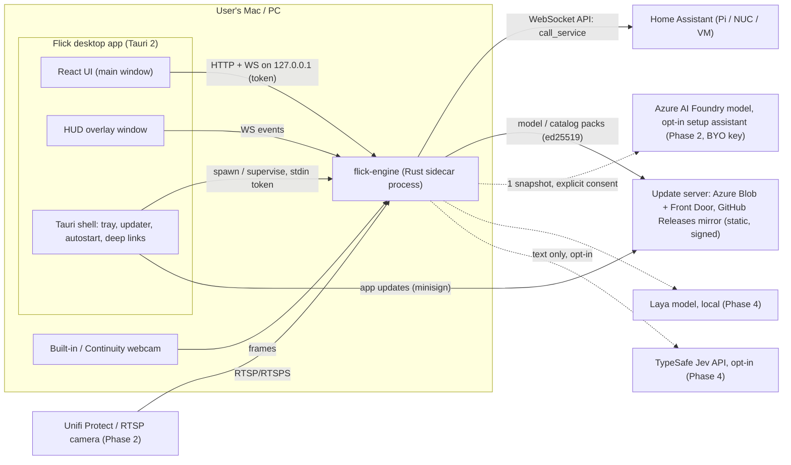
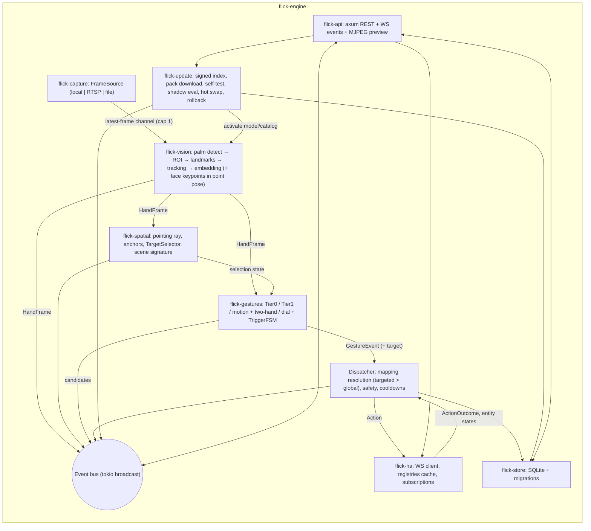
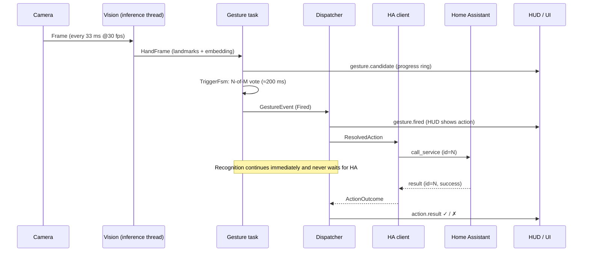

# 01 — Architecture

## 1. System context



**Key principle:** all heavy work (capture, decode, inference, gesture logic, the HA connection) runs in **`flick-engine`**, a single Rust binary.
The desktop app is a thin shell plus UI. The same engine binary runs **headless** on an always-on Mac mini/PC/Linux box (Phase 3).

## 2. Architecture Decision Records (ADRs)

Each ADR: decision → why → consequences. Changing a decision requires updating this table and the decision log (§10).

| ID | Decision | Why | Consequences / rejected |
|---|---|---|---|
| ADR-001 | **Rust (edition 2024, tokio)** for engine and shell | Near-C++ speed, memory safety, cross-compiles to macOS/Windows/Linux (x64 + arm64), same language as Tauri | Python kept only for offline tooling. Rejected: Python (GIL, packaging), C++ (safety, velocity), Go (ML/FFI), Swift (Apple-only) |
| ADR-002 | **ONNX Runtime via `ort` 2.x** for all inference | One model format; hardware acceleration per OS: CoreML, DirectML, CUDA/TensorRT, OpenVINO, XNNPACK, CPU | Models must be converted/validated to ONNX (Phase 0). Rejected: TFLite (weak desktop GPU support), MediaPipe C++ (Bazel) |
| ADR-003 | **Tauri 2** desktop shell | ~10 MB app, native webview, tray/updater/deep-link plugins, macOS + Windows + Linux (mobile later) | Webview differences (WKWebView/WebView2/WebKitGTK) need testing. Rejected: Electron (heavy), SwiftUI (Apple-only) |
| ADR-004 | **React 19 + TypeScript + Vite + Tailwind + shadcn/ui**, TanStack Query + Zustand | The engine does the hot-path work; React is best known by coding agents | Rejected: Svelte 5 (agents mix in Svelte 4 syntax), Leptos/Dioxus (small ecosystem) |
| ADR-005 | **Engine runs as a sidecar process**; UI talks to it over **HTTP + WebSocket on 127.0.0.1** (axum) with a new token per launch | Crash isolation (native FFmpeg/ORT crashes don't kill the UI); identical code path in desktop and headless modes; UI reusable in a browser later | Sidecar must be signed/notarized with the app; localhost API needs careful security (§7 of `07-…`). Rejected: in-process + Tauri IPC only (locks the UI to the desktop, no isolation) |
| ADR-006 | **Home Assistant WebSocket API, direct `call_service`** | One persistent low-latency socket for commands, `result` acks, device listings and targeted state subscriptions; zero HA-side configuration | Rejected: webhooks (one-way, need an automation per gesture), REST (new request per call, no push), HA events/MQTT (**out of scope by product decision**) |
| ADR-007 | **MediaPipe hand models (palm detector, hand landmarker, gesture embedder, canned classifier), Apache-2.0, converted to ONNX.** Plus **BlazeFace short-range** (eye keypoints, run only in point pose) and **DINOv2-small** (scene signature, every 60 s) for device targeting | Pre-trained, accurate, tiny, ~5 ms/stage on Apple Silicon. HF gesture classifiers and cloud vision were evaluated and rejected (`11-…`) | Must match the MediaPipe reference output (parity tests). Rejected: Ultralytics YOLO-pose (AGPL, blocks Pro); HF image gesture classifiers (fixed labels, can't learn from the UI); Azure Vision (latency, privacy, retiring) |
| ADR-008 | **Few-shot custom gestures, all learned in-app in < 1 s:** static poses on 128-d gesture embeddings (prototype + k-NN with open-set rejection); **motion and two-hand gestures as DTW templates** over normalized trajectories (Core) | Minimal training, instant feedback, no GPU, landmarks-only storage; users create any gesture in the Studio | Custom static gestures must be poses the embedder can separate. A learned Motion Embedder (Phase 2 research, trained on Azure ML, shipped via OTA) may replace raw DTW features later |
| ADR-009 | **No LLM/Jev in the recognition hot path.** Optional "Smart Context" later (Laya local by default, Jev API opt-in) only chooses between user-defined candidate actions | Jev only takes text in (no vision); recognition must stay deterministic and fast | Smart Context is Phase 4 and behind the `ActionPlanner` trait |
| ADR-010 | **Compute runs on the user's Mac/PC, not as an HA add-on** | HA hosts are usually low-power; laptops/desktops have NPUs/GPUs | Users need a machine that stays on for 24/7 RTSP use (headless mode, Phase 3) |
| ADR-011 | **SQLite (`rusqlite`, bundled)** for app data; `config.toml` for bootstrap-only settings | Portable, zero-ops, transactional | Migrations are embedded and run at startup |
| ADR-012 | **Open-core**: Apache-2.0 public repo + private `flick-pro` crates plugged in through core traits | Community growth plus revenue | Core must expose stable extension traits; no DRM code in core |
| ADR-013 | **Landmarks are the source of truth** for gesture samples (embeddings are a derived cache) | Privacy (no images); re-embedding when models change; portable gesture packs | Samples store 21×3 image + 21×3 world landmarks |
| ADR-014 | **REST contract via OpenAPI** (`utoipa`) → TypeScript types (`openapi-typescript` + `openapi-fetch`) | Single source of truth for DTOs, including WS event schemas | DTO changes require regenerating `ui/src/api/schema.d.ts` (CI check) |
| ADR-015 | **OTA for 3 artifact types:** app bundle via `tauri-plugin-updater` (minisign); model and catalog packs via `flick-update` (TUF-inspired signed metadata, ed25519, hot swap, local shadow evaluation, auto-rollback); channels + client-side staged rollout (`10-…`) | Models and gesture parameters improve more often than code; hot swap avoids restarts; local validation prevents regressions on the user's own gestures | Needs an offline root key, CI signing keys in Key Vault, and forward-only DB migrations. Rejected: app-only updates (slow model fixes), remote config without signatures |
| ADR-016 | **Device targeting by pointing** (`flick-spatial`): point pose + eye-rooted ray (fallback finger-only) → taught anchors per place → selection window → verb gestures resolved per domain (`09-…`) | Scales to many devices with few gestures; selection lowers false triggers; teaching by pointing works without the camera seeing the device | Accuracy depends on ray estimation (spike P0-08); anchors are invalidated when a laptop moves (scene signature + re-align). Rejected: device lists in the HUD (slow), object detection only (the camera often can't see the device) |
| ADR-017 | **Cloud policy:** no cloud in the recognition path. Azure is used for Flick's infrastructure (update hosting, Artifact Signing, Key Vault, Azure ML training/eval) and **opt-in** setup/Smart Context features only (BYO key or Pro) (`11-…`) | Latency (local ≈ 10 ms vs ≥ 150 ms cloud), privacy, offline use, per-frame cost; relevant Azure vision services are retired or retiring | Owner's Azure credits cover dev/infra only; end-user cloud features need a key or Pro billing |
| ADR-018 | **Frontend design via the Impeccable skill:** `PRODUCT.md` (strategy) + `DESIGN.md` (visual system) at the repo root; every UI task runs `/impeccable shape` → build → `critique` + `audit` + detector → `polish` (`04-…` §0) | A consistent, modern, distinctive UI built by coding agents; objective anti-pattern checks in review | UI PRs must include the detector output; DESIGN.md is created before any UI work (P1-700) |
| ADR-019 | **Lean, behavior-focused tests:** tests only for hard logic, costly/silent failures, cross-boundary contracts and fixed bugs; one replay harness, one mock HA, 5 UI journeys; no coverage targets (`07-…` §1) | Agent-written code tends to arrive with oversized test suites for trivial or unused code, which slows CI and hides the tests that matter | Each PR lists what every new test protects against; reviewers reject trivial tests. Rejected: coverage gates (they reward testing trivial code), per-route API tests, UI snapshot/visual-regression suites |

## 3. Component view (engine)



### Core traits (in `flick-core`)

These are the extension points Pro crates plug into. Signatures are normative; add methods only with default implementations.

```rust
pub trait FrameSource: Send + 'static {
    fn info(&self) -> &SourceInfo;                      // id, kind, resolution, fps, mirror
    fn next_frame(&mut self) -> Result<Frame, CaptureError>; // blocking; called on a dedicated thread
    fn set_target_fps(&mut self, fps: u32) {}           // idle/active switching
}

pub trait HandPipeline: Send + 'static {
    fn process(&mut self, frame: &Frame) -> Result<HandFrame, VisionError>;
}

pub trait GestureRecognizer: Send + 'static {
    fn id(&self) -> &'static str;
    fn update(&mut self, hands: &HandFrame) -> SmallVec<[GestureCandidate; 4]>;
}

#[async_trait::async_trait]
pub trait ActionSink: Send + Sync + 'static {
    async fn execute(&self, action: &ResolvedAction) -> ActionOutcome;
}

/// Device targeting (`09-…`). One per camera; runs on the gesture task after recognizers.
pub trait TargetSelector: Send + 'static {
    fn update(&mut self, hands: &HandFrame, face: Option<&FaceKeypoints>) -> SelectionState; // Idle | Aiming | Hover | Selected
    fn selected(&self) -> Option<AnchorId>;
    fn refresh(&mut self);                              // called after a targeted verb fires
    fn clear(&mut self);
}

/// Model/catalog pack activation (`10-…`). Implemented by flick-update; consumed by flick-vision/gestures.
pub trait PackRegistry: Send + Sync + 'static {
    fn active(&self, kind: PackKind) -> Arc<ActivePack>; // cheap clone; swapped atomically between frames
    fn subscribe(&self) -> tokio::sync::watch::Receiver<PackGeneration>;
}

/// Phase 4 (Smart Context). Default impl = pass-through first candidate.
#[async_trait::async_trait]
pub trait ActionPlanner: Send + Sync + 'static {
    async fn choose(&self, event: &GestureEvent, candidates: &[MappingId], ctx: &PlannerContext) -> Option<MappingId>;
}

/// Implemented by core (defaults) and overridden by Pro.
pub trait Entitlements: Send + Sync + 'static {
    fn max_cameras(&self) -> CameraLimits;              // core: 1 local + 1 RTSP
    fn has(&self, feature: ProFeature) -> bool;         // core: always false
}
```

### Core data types (abbreviated; full definitions in `06-data-model-and-api.md`)

```rust
pub struct Frame { pub camera_id: CameraId, pub seq: u64, pub captured_at: Instant, pub wall_ts: SystemTime,
                   pub width: u32, pub height: u32, pub format: PixelFormat /* Rgb8 | Bgra8 | Nv12 */, pub data: Arc<[u8]> }

pub struct HandObservation { pub track_id: u32, pub hand: Handedness /* user's physical Left | Right */, pub handedness_score: f32,
                             pub presence: f32, pub image: [[f32; 3]; 21], pub world: [[f32; 3]; 21], pub bbox: RectF,
                             pub embedding: Option<[f32; 128]> }

pub struct HandFrame { pub camera_id: CameraId, pub seq: u64, pub captured_at: Instant, pub hands: SmallVec<[HandObservation; 2]>,
                       pub timings: StageTimings }

pub struct GestureEvent { pub id: Ulid, pub camera_id: CameraId, pub gesture_id: GestureId, pub hand: Handedness,
                          pub confidence: f32, pub phase: GesturePhase /* Fired | Update | End */, pub value: Option<f32>,
                          pub target: Option<AnchorId> /* set when a device is selected (09-…) */,
                          pub onset_at: Instant, pub fired_at: Instant }
```

## 4. Runtime & threading model

| Unit | Type | Count | Responsibility |
|---|---|---|---|
| Capture worker | dedicated OS thread | 1 per camera | Blocking `next_frame()`, pixel conversion, pushes into a **latest-frame-wins** slot (capacity 1; stale frames are dropped, never queued) |
| Inference worker | dedicated OS thread | 1 per camera | Owns its `ort::Session`s; runs `HandPipeline`; publishes `HandFrame` |
| Gesture task | tokio task | 1 per camera | Runs recognizers + `TriggerFsm`; emits `GestureEvent` |
| Dispatcher | tokio task | 1 | Resolves mappings, applies safety/cooldowns, calls `ActionSink`, writes activity log |
| HA client | tokio task | 1 per HA instance (MVP: 1) | Owns the WebSocket; request-id map; reconnect; subscriptions |
| API server | tokio (axum) | 1 | REST, WS events, MJPEG preview |
| Supervisor | tokio task | 1 | Restarts crashed workers with backoff; exposes health |

- Tokio runtime: multi-thread, `worker_threads = 2` (the hot path is on dedicated threads).
- Inter-unit channels: `tokio::sync::mpsc` (bounded) for commands, `tokio::sync::broadcast` (capacity 256) for UI events, `tokio::sync::watch` for status.
- ORT threading: `intra_op_num_threads = 2` per session by default; `inter_op = 1`.
- A panic in a worker is caught at the thread boundary (`std::panic::catch_unwind`); the supervisor restarts it (backoff 0.5 s → 30 s).
  A native crash kills only the sidecar; the desktop shell restarts it (`05-…` §4).

## 5. End-to-end flow & latency budget



Target hardware: Apple M1, 720p webcam @30 fps. All figures p95.

| Stage | Budget |
|---|---|
| Capture conversion (NV12/BGRA → RGB, resize) | ≤ 3 ms |
| Palm detection (only when not all hands are tracked, or every 10th frame) | ≤ 4 ms |
| Hand landmarks (per hand) | ≤ 4 ms |
| Gesture embedding + classification | ≤ 1 ms |
| Trigger FSM | ≤ 0.2 ms |
| **Confirmation window** (default 6 of 8 frames) | ≈ 200 ms |
| Dispatch + WS send | ≤ 2 ms |
| **Onset → `call_service` sent** | **≤ 300 ms** |
| HA service execution (integration-dependent; fast local integrations) | 10–100 ms |
| **Onset → ack (fast local integrations)** | **≤ 350 ms** |
| Targeted path: point + dwell → verb → `sent` (`09-…` §9) | ≈ 1.2–2.0 s (deliberate; dwell 500 ms + verb) |
| Face keypoints (only while the point pose is active) | ≤ 2 ms |
| Pointing ray + anchor scoring | ≤ 0.3 ms |
| Model pack hot swap | 0 dropped frames (session built off-thread, pointer swap between frames) |
| RTSP (Unifi) extra camera latency (Phase 2) | +300–800 ms (camera/NVR dependent) |

Adaptive frame rate:
- **Idle mode:** 5 fps, palm detector only, on a downscaled frame.
- Switch to **active mode** (30 fps) when a palm is detected.
- Return to idle after 2 000 ms without hands.

## 6. Repository layout (monorepo)

```
flick/
├─ Cargo.toml                 # [workspace], shared lints, profile settings
├─ rust-toolchain.toml        # pinned stable toolchain
├─ deny.toml                  # cargo-deny: licenses + advisories
├─ crates/
│  ├─ flick-core/             # domain types, traits, errors, config structs (no I/O)
│  ├─ flick-capture/          # LocalCameraSource (nokhwa / native), RtspSource (ffmpeg-next), FileSource (tests)
│  ├─ flick-vision/           # ORT sessions, palm decode, ROI, landmarks, tracking, One-Euro, embedder, face keypoints
│  ├─ flick-gestures/         # Tier0, Tier1 (few-shot), motion + two-hand (swipe, circles, DTW templates, pinch-dial), TriggerFsm
│  ├─ flick-spatial/          # pointing ray (PnP, nalgebra), anchors, triangulation, TargetSelector, scene signature, re-align
│  ├─ flick-update/           # OTA: signed channel index, pack download/verify, self-test, shadow eval, activation, rollback
│  ├─ flick-ha/               # HA WebSocket client, protocol types, registry cache, mDNS discovery
│  ├─ flick-store/            # SQLite schema, migrations, repositories
│  ├─ flick-api/              # axum routes, DTOs (utoipa), WS events, MJPEG
│  └─ flick-engine/           # lib (Engine::start) + bin `flick-engine` (CLI, sidecar/headless)
├─ apps/
│  └─ desktop/src-tauri/      # crate `flick-desktop`: tray, windows, sidecar supervisor, plugins
├─ ui/                        # package `@flick/ui` (React). Built into the desktop app; embedded in the engine for headless mode
├─ PRODUCT.md                 # Impeccable product context (strategy, users, principles)
├─ DESIGN.md                  # Impeccable visual system (created in P1-700)
├─ models/
│  └─ manifest.toml           # model ids, versions, URLs, sha256, input/output specs (bundled baseline packs)
├─ catalog/                   # catalog pack sources: gesture params, verb presets, FOV table, safety additions (JSON + schema)
├─ infra/
│  └─ updates.bicep           # Azure Blob + Front Door for OTA hosting
├─ tools/
│  ├─ training/               # Python (uv): conversion, parity, Model Maker experiments, Azure ML jobs
│  ├─ fixtures/               # recorded landmark JSONL + short test videos (self-recorded, CC0)
│  └─ ha-e2e/                 # docker-compose HA + bootstrap script (token creation)
├─ xtask/                     # cargo xtask: fetch-models, gen-api, bench, record-landmarks, bundle, build-pack, sign-index, serve-updates
└─ docs/spec/                 # this spec
```

Private repo **`flick-pro`** (Phase 3):
- `flick-pro-cameras` (multi-camera, zones, multi-camera anchor fusion)
- `flick-pro-farfield` (body gestures + far-field targeting)
- `flick-pro-context` (Smart Context)
- `flick-pro-license`

Added as optional git dependencies behind the `pro` cargo feature of `flick-engine` and `flick-desktop`.

## 7. Technology versions (baseline Sep 2026; pin at scaffold time)

| Area | Crate / package | Baseline |
|---|---|---|
| Desktop | `tauri` | 2.12 |
| Inference | `ort` | 2.0.0-rc.13 (ONNX Runtime 1.2x) |
| Camera | `nokhwa` | 0.10 (fallback: `objc2-av-foundation` on macOS) |
| RTSP | `ffmpeg-next` | 9.x (LGPL FFmpeg 7/8, dynamic) |
| HTTP/WS server | `axum` | 0.8 |
| WS client | `tokio-tungstenite` | 0.30 (rustls) |
| mDNS | `mdns-sd` | 0.21 |
| Secrets | `keyring` | 4.2 |
| DB | `rusqlite` (bundled) + `rusqlite_migration` | latest |
| OpenAPI | `utoipa` + `utoipa-axum` | latest |
| Logging | `tracing`, `tracing-subscriber`, `tracing-appender` | latest |
| UI | React 19, Vite, Tailwind 4, shadcn/ui, TanStack Query 5, Zustand 5 | latest |
| API client | `openapi-typescript`, `openapi-fetch` | latest |
| Updater | `tauri-plugin-updater` | 2.x |
| Geometry | `nalgebra` | 0.33+ |
| Signatures / packs | `ed25519-dalek` 2.x, `sha2`, `zstd`, `tar` | latest |
| HTTP client (updates) | `reqwest` (rustls, range requests) | latest |

## 8. Build profiles

- `release`: `lto = "thin"`, `codegen-units = 1`, `panic = "unwind"` (needed for worker panic recovery), `strip = "symbols"`; debug symbols uploaded separately.
- macOS MVP target: `aarch64-apple-darwin`. CI also builds `x86_64-pc-windows-msvc` and `x86_64-unknown-linux-gnu`.
- Models are not committed. `cargo xtask fetch-models` downloads them into `models/cache/` and checks their sha256 against `models/manifest.toml`; the bundler copies them into app resources.

## 9. References

- HA WebSocket API — https://developers.home-assistant.io/docs/api/websocket
- HA auth API — https://developers.home-assistant.io/docs/auth_api
- MediaPipe Gesture Recognizer — https://ai.google.dev/edge/mediapipe/solutions/vision/gesture_recognizer
- MediaPipe Model Maker (gesture customization) — https://ai.google.dev/edge/mediapipe/solutions/customization/gesture_recognizer
- ONNX ports: PINTO0309 hand-gesture-recognition-using-onnx; Qualcomm MediaPipe-Hand-Detection (Hugging Face)
- `ort` — https://ort.pyke.io · Tauri 2 — https://v2.tauri.app
- Laya (Apache-2.0) — https://github.com/NandhaKishorM/laya · Jev — https://typesafe.ai/blog/introducing-system-one-models-and-jev
- V-JEPA 2 (MIT) — https://github.com/facebookresearch/vjepa2
- Tauri updater — https://v2.tauri.app/plugin/updater · TUF — https://theupdateframework.io
- Foundry Local — https://learn.microsoft.com/azure/foundry-local/ · Azure Artifact Signing — https://learn.microsoft.com/azure/artifact-signing/
- Impeccable (Apache-2.0) — https://impeccable.style

## 10. Decision log

| Date | Change |
|---|---|
| 2026-09-28 | Initial ADR-001…014. Product name **Flick**. HA integration limited to direct service calls. |
| 2026-09-28 | Added ADR-015 (OTA), ADR-016 (device targeting by pointing), ADR-017 (cloud policy), ADR-018 (Impeccable design process). ADR-007 adds BlazeFace + DINOv2-small; ADR-008 moves motion/two-hand DTW templates into Core. New crates `flick-spatial`, `flick-update`; `flick-pro-motion` removed. |
| 2026-09-28 | Added ADR-019 (lean testing policy). Trimmed the required test lists in 03, 07, 08, 09 and 10; removed the coverage goal. |
| 2026-10-03 | Gesture latency tuning: targeted/either verbs fire on 3 of 8 votes while a device is selected (`detection.vote.selected_n`); a held tap hands off to a new mapped gesture without the `release_ms` wait; point-stable 120 ms, dwell 300 ms. Updated 02, 04, 06 and 09. |
