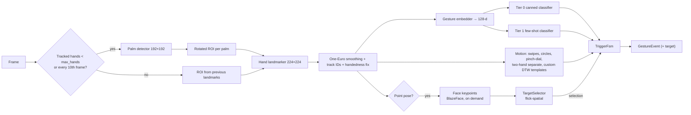
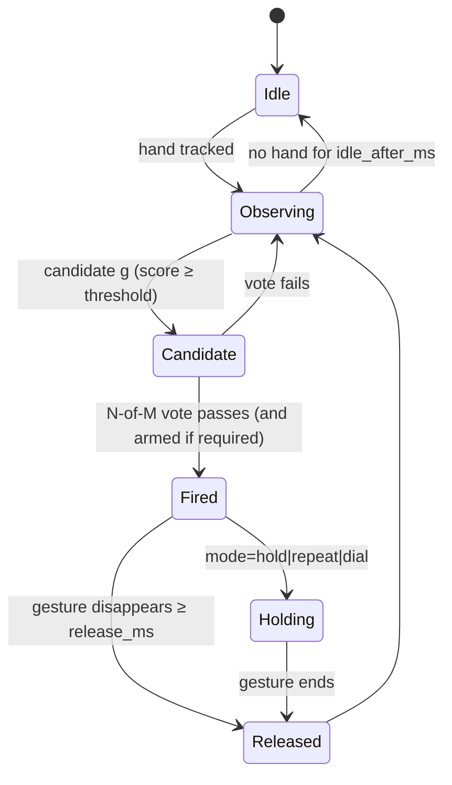

# 02 — Vision pipeline

Crates: `flick-capture`, `flick-vision`, `flick-gestures` (device targeting lives in `flick-spatial`, see `09-device-targeting.md`).
Goal: turn camera frames into **reliable, low-latency `GestureEvent`s** with minimal or no user training.

## 1. Capture (`flick-capture`)

### 1.1 Sources

| Source | Phase | Implementation | Notes |
|---|---|---|---|
| `LocalCameraSource` | 1 | `nokhwa` (AVFoundation / Media Foundation / V4L2) | Request 1280×720 @30 fps in NV12/YUYV/MJPEG, whatever the device offers. Convert to RGB8 in the worker |
| `MacNativeSource` (fallback) | 1 if needed | `objc2-av-foundation` | Needed if `nokhwa` can't list **Continuity Camera** devices (`AVCaptureDeviceTypeContinuityCamera`, requires `NSCameraUseContinuityCameraDeviceType` in Info.plist). Decided in spike P0-04 |
| `RtspSource` | 2 | `ffmpeg-next` (LGPL FFmpeg, dynamically linked) | `rtsp://` and `rtsps://` (Unifi Protect). Hardware decode: VideoToolbox / D3D11VA / CUDA / VAAPI, CPU fallback |
| `FileSource` | 1 (tests) | `ffmpeg-next` or image-sequence reader | Enabled with `FLICK_FAKE_CAMERA=/path/video.mp4` or `--fake-camera`. Plays at real-time pace by default; `--fast` plays as fast as possible |

### 1.2 Frame handling rules
- **Latest frame wins:** the capture thread overwrites a single-slot buffer; the inference thread always takes the newest frame. **Never queue frames** (queues add latency).
- Pixel conversion: `yuv`/`dcv-color-primitives` or hand-written SIMD NV12→RGB. Budget ≤ 3 ms at 720p.
- Per-camera settings:
  - `mirror` (bool; default `true` for local front cameras, `false` for RTSP)
  - `rotation` (0/90/180/270)
  - `max_hands` (1–2, default 2)
  - `active_fps` / `idle_fps`
  - `roi` (optional normalized rect; Pro zones extend this)
- Device loss → `CaptureError::Disconnected` → supervisor retries every 2 s; UI shows camera status.

### 1.3 RTSP / Unifi Protect specifics (Phase 2)
- Unifi Protect: enable RTSP per camera (Protect → camera → Settings → Advanced → RTSP → pick a quality).
  It provides `rtsps://<nvr>:7441/<token>?enableSrtp`; the plain alternative is `rtsp://<nvr>:7447/<token>`.
- Accept both. For RTSPS allow **"trust self-signed certificate"** per camera (default on for Unifi hosts, with a warning).
- FFmpeg options (low latency): `rtsp_transport=tcp`, `fflags=nobuffer`, `flags=low_delay`, `max_delay=0`,
  `probesize=32768`, `analyzeduration=0`, `reorder_queue_size=0`. Decode with `thread_type=slice`, and skip non-reference frames if decode falls behind.
- Prefer the **medium (720p)** stream for near-field and **high (1080p/4K)** for far-field (Phase 4).
- Reconnect with backoff 1 s → 30 s. Show `camera.status` = `reconnecting`.
- Credentials (if the URL has user:pass) go to the OS keychain. Store the **redacted** URL only (`rtsps://nvr:7441/****`).

## 2. Models (`models/manifest.toml`)

| Model id | Source | Input | Outputs | Use |
|---|---|---|---|---|
| `palm_detection_full` | MediaPipe (Apache-2.0) → ONNX | 1×192×192×3 f32 [0,1] (NHWC; transpose if the ONNX port is NCHW) | regressors 1×2016×18, scores 1×2016×1 | Palm boxes + 7 keypoints |
| `hand_landmark_full` | MediaPipe → ONNX | 1×224×224×3 f32 [0,1] | 63 image coords, presence 1, handedness 1, 63 world coords | 21 landmarks per hand |
| `gesture_embedder` | MediaPipe `hand_gesture_recognizer.task` → ONNX | landmarks 1×21×3, handedness 1×1, world 1×21×3 | 1×128 | Embedding for Tier 0/1 |
| `canned_gesture_classifier` | same `.task` → ONNX | 1×128 | 1×8 | Tier 0 labels |
| `face_detection_short` | MediaPipe BlazeFace short-range (Apache-2.0) → ONNX | 1×128×128×3 f32 | 896 anchors × (box + 6 keypoints), scores | Eye keypoints for the pointing ray. **Runs only while the point pose is active** (`09-…` §3) |
| `scene_embedder` | `facebook/dinov2-small` (Apache-2.0) → ONNX int8 | 1×3×224×224 | 1×384 CLS | Scene signature every 60 s ("camera moved", `09-…` §6). OTA pack, downloaded on first anchor teach |
| `pose_lite` (Phase 2) | MediaPipe Pose lite (Apache-2.0) → ONNX | 1×256×256×3 | 33 keypoints | Arm-rooted pointing ray for RTSP cameras |

- All models are delivered as **OTA model packs** (`10-ota-updates.md` §5). The app bundle ships a baseline set; newer versions are hot-swapped after local validation. Setup-time helpers (OWLv2, Florence-2, SAM 2.1 tiny, Depth Anything V2 Small) are on-demand packs and never run per frame (`11-…` §4).

- Tensor names/shapes above are **expected**. Spike P0-02 confirms them with `onnx` inspection and records the final values in the manifest.
- Candidate sources (in order):
  1. self-convert from the official `.task`/`.tflite` with `tf2onnx`/`tflite2onnx`;
  2. PINTO0309 ONNX ports (some include built-in post-processing, e.g. `*_inf_post_*`);
  3. Qualcomm AI Hub ONNX exports.
- Every model entry: `id`, `version`, `url`, `sha256`, `license`, `inputs`, `outputs`, `preferred_ep`.
  Models are verified against the sha256 on load; a mismatch refuses to start the pipeline.

### 2.1 Execution providers
- Order per platform (overridable in `config.toml` `[inference].execution_provider`):
  - macOS: `CoreML` (ANE+GPU+CPU), then `XNNPACK`, then `CPU`
  - Windows: `DirectML`, then `CPU`
  - Linux: `CUDA` (if available), then `OpenVINO`, then `XNNPACK`, then `CPU`
- **Auto-benchmark at first start** (and after a model/EP change):
  - run 50 warm-up + 100 timed inferences per model on each available EP;
  - keep the fastest for each model and store the choice in `settings` (`inference.ep_choice`).
  - Tiny models are sometimes faster on XNNPACK/CPU than CoreML because of dispatch overhead.
- CoreML: enable the model cache directory (`models/cache/coreml/`) to avoid recompiling on every launch.

## 3. Hand perception (`flick-vision`)

### 3.1 Palm detection
- Letterbox the frame to 192×192 (keep aspect ratio, pad with zeros), normalize to [0,1].
- Anchors: MediaPipe SSD anchor options for the full palm model:
  - `num_layers=4`, `strides=[8,16,16,16]`
  - `min_scale=0.1484375`, `max_scale=0.75`
  - `anchor_offset=0.5`, `aspect_ratios=[1.0]`, `fixed_anchor_size=true`
  - Total **2016** anchors, generated once at startup.
- Decode: `x_scale=y_scale=w_scale=h_scale=192`; sigmoid scores; `min_score = 0.5`; **weighted NMS**, IoU 0.3.
- Un-letterbox boxes and keypoints to frame coordinates.

### 3.2 ROI (palm → hand crop)
- Rotation: `θ = π/2 − atan2(−(kp2.y − kp0.y), kp2.x − kp0.x)`, normalized to [−π, π].
  Keypoint 0 = wrist center, keypoint 2 = middle-finger MCP.
- Rect: from the palm box. Shift `y` by −0.5·h in rotated space, scale ×2.6, make square (long side).
- Affine-warp the frame into 224×224 (bilinear). Keep the inverse matrix for projecting landmarks back.

### 3.3 Landmarks & tracking
- Run the landmarker on each ROI. Drop the hand if `presence < 0.5` (`min_hand_presence`).
- Project the 21 image landmarks back to frame-normalized [0,1] coordinates; keep the 21 world landmarks in meters (hand-centered).
- **Next-frame ROI from landmarks** (tracking): bounding rect of all landmarks, rotation from landmark 0 → 9, scale ×2.0, shift y −0.1.
  Skip palm detection while every tracked hand keeps `presence ≥ 0.5`. Run palm detection anyway every 10th frame when `hands < max_hands`, to find new hands.
- Track IDs: match by IoU ≥ 0.3 plus handedness consistency; new ID otherwise. A track dies after 5 missed frames.
- **Handedness normalization:**
  - MediaPipe assumes **mirrored (selfie) input**. For non-mirrored frames (the raw webcam buffer, RTSP), swap Left/Right.
  - `HandObservation.hand` always means the **user's physical hand**. A fixture test covers both mirror settings.
- **Smoothing:** One-Euro filter per landmark coordinate (`min_cutoff=1.0`, `beta=0.02`, `d_cutoff=1.0`, tuned in P0).
  Raw landmarks feed the embedder; smoothed landmarks feed motion/dial and the UI overlay.
- **Min hand size:** ignore hands with bbox height < 6 % of frame height (`min_hand_size`). This rejects background people and tiny false detections.

### 3.4 Embedding
- Input: raw image landmarks (frame-normalized), handedness score, world landmarks → `gesture_embedder` → 128-d f32.
- Computed only for **tracked, sufficiently large** hands. Cost ≈ 0.3 ms.
- Stored in `HandObservation.embedding`.

## 4. Gesture recognition (`flick-gestures`)

### 4.1 Gesture catalog

| Gesture id | Tier | Kind | Training | Core/Pro |
|---|---|---|---|---|
| `builtin.closed_fist` | 0 | static | none | Core |
| `builtin.open_palm` | 0 | static | none | Core |
| `builtin.pointing_up` | 0 | static | none | Core |
| `builtin.thumb_up` | 0 | static | none | Core |
| `builtin.thumb_down` | 0 | static | none | Core |
| `builtin.victory` | 0 | static | none | Core |
| `builtin.i_love_you` | 0 | static | none | Core |
| `builtin.point` | 0 | static (geometric; any direction) | none | Core; reserved for device targeting when the camera has anchors (`09-…` §2) |
| `custom.<ulid>` | 1 | static | 5–20 samples | Core |
| `builtin.swipe_left` / `_right` / `_up` / `_down` | 2 | motion | none | Core |
| `builtin.pinch_dial` | 2 | dial (continuous) | none | Core |
| `builtin.circle_cw` / `builtin.circle_ccw` | 2 | motion | none | Core |
| `builtin.two_hand_separate` ("stop") | 2 | two-hand motion | none | Core |
| `motion.<ulid>` (custom motion or two-hand template) | 2 | motion | 3–5 takes | Core |
| `system.none` | — | negative class | auto-collected | internal |

Canned classifier label order (verify in P0-02): `None, Closed_Fist, Open_Palm, Pointing_Up, Thumb_Down, Thumb_Up, Victory, ILoveYou`.

Any single-hand gesture can be constrained to `left`, `right`, or `any` hand in a mapping, which doubles the vocabulary with no extra training.
Built-in parameters (thresholds, windows, cooldowns) are defaults delivered by the **catalog pack** (`10-…` §5.3); user overrides always win.

### 4.2 Tier 0 — built-ins
- Score = canned classifier softmax.
- Candidate if `top1 ≠ None`, `score ≥ tier0_threshold` (default **0.70**), and margin over the second-best ≥ 0.15.
- **`builtin.point`** is geometric, not from the canned classifier:
  - index finger extended (MCP–PIP–DIP–TIP joint angles ≥ 160°);
  - middle, ring and pinky curled (tip closer to the wrist than their PIP);
  - thumb ignored; stable ≥ 200 ms.
  - It works in any direction, unlike `pointing_up`.
  - It feeds the `TargetSelector` and is not mappable to global actions while the camera has anchors.
- `builtin.pointing_up` global mappings fire only when **no anchor is hovered** (`09-…` §5.3).

### 4.3 Tier 1 — few-shot custom static gestures
- **Sample capture:** one *take* = user holds the pose for 1.5 s. Keep 10 evenly spaced frames whose presence ≥ 0.8 and where the hand is fully in frame (all landmarks within [0.02, 0.98]).
- **Augmentation** (on landmarks, before embedding), ×4 per frame:
  - in-plane rotation ±15°
  - scale ±10 %
  - x/y jitter ±2 % of hand size
  - if the gesture's hand is `any`: mirror (flip x, swap handedness)
- **Negatives:** class `system.none`.
  - Seeded with a bundled set of neutral-hand embeddings.
  - Plus 5 s of "relax / move naturally" frames captured once during the first custom-gesture recording.
  - Plus the embeddings of all *other* enabled static gestures.
- **Classifier `ProtoKnn`** (pure Rust, trains in ≪ 1 s):
  1. L2-normalize embeddings.
  2. Per class: prototype = mean vector; spread `σ_c` = 90th percentile cosine distance of the class samples to their prototype.
  3. Predict: cosine similarity to all prototypes, plus a k-NN vote (k = 5) over all samples.
     `score = 0.5·softmax_τ(prototype sims) + 0.5·knn_fraction`, with τ = 0.05.
  4. **Open-set rejection:** reject if distance to the winning prototype > `σ_c · 1.5`, or if the winner is `system.none`.
  5. Per-gesture threshold defaults to **0.75**; the user can adjust it.
- **Quality metrics after training** (shown in the Studio):
  - leave-one-take-out accuracy
  - nearest confusable gesture + similarity
  - "distinctiveness" = 1 − max cosine similarity between this prototype and the others. Warn if < 0.15.
- **Model versioning:** each trained model records `embedder_version`. If the embedder changes, re-embed from stored landmarks and retrain automatically.
- **Upgrade path (optional):** if `ProtoKnn` accuracy < 90 % with ≥ 3 custom classes, offer "Improve accuracy" to train a small multinomial logistic-regression head (128→K, L2 = 1e-3, 200 iterations of L-BFGS/GD). Still < 1 s.

### 4.4 Tier 2 — motion gestures
Motion features use **smoothed** landmarks, computed in **palm units**: palm size = distance(landmark 0, landmark 9).
This makes thresholds roughly distance-invariant from 0.5 to 3 m.

**Swipes** (`builtin.swipe_*`)
- Track the palm center (mean of landmarks 0, 5, 9, 13, 17) in a 1 s ring buffer.
- Fire when, within a window of **120–700 ms**:
  - displacement ≥ **3.0 palm sizes**
  - straightness (net / path length) ≥ **0.8**
  - direction within ±30° of an axis
  - the pose during the motion is `open_palm` for ≥ 60 % of frames (configurable; reduces false positives from normal arm movement)
- Directions are from the **user's perspective** (after mirror normalization): the right hand moving toward the user's right = `swipe_right`.
- Cooldown after a swipe: 600 ms, so the return motion is ignored.

**Pinch-dial** (`builtin.pinch_dial`, continuous)
- Pinch ratio = distance(thumb tip 4, index tip 8) / palm size.
  - Enter when < **0.25** for ≥ 150 ms.
  - Exit when > **0.35** (hysteresis) or the hand is lost for > 300 ms.
- While pinched: value delta = −Δy of the pinch point (mean of 4 and 8) / (0.5 × frame height).
  Moving up increases the value; the full 0→100 % range spans half the frame height. Clamped.
- Emits `GestureEvent` phases `Fired` (pinch start) → `Update` (value, ≤ 8 Hz) → `End`.

**Circles** (`builtin.circle_cw` / `_ccw`, Core): accumulate the signed angle of the index tip (8) around the trajectory centroid.
- Fire at |Σθ| ≥ 300° within 1.5 s, with radius ≥ 1.0 palm size and radius CV < 0.35.
- Direction is from the user's perspective (after mirror normalization).
- Works with any hand pose. In targeting mode the user typically keeps pointing while circling; the selection lock (`09-…` §2) prevents reselection.
- A mapping may use `builtin.circle_any` (either direction) as a gesture alias.
- Cooldown 700 ms. A continuous circling motion fires once per 360° when the mapping is in `repeat` mode (e.g. "next speed level" per turn).

**Two-hand separate** (`builtin.two_hand_separate`, "stop", Core):
- **Start:** 2 tracked hands with palm centers within **1.5 palm sizes** of each other and one above the other (vertical offset ≥ horizontal offset), held ≥ **150 ms**. Palms are open or flat; the exact pose is not required.
- **Motion:** within **150–800 ms**:
  - inter-hand distance grows by ≥ **3.0 palm sizes**;
  - the hands move in opposite directions (cosine of the velocity vectors ≤ −0.5).
- **Direction:** agnostic by default (vertical or horizontal separation both count). Setting `gestures.two_hand_separate.axis` = `any` (default) | `vertical` | `horizontal`.
- Cooldown 800 ms. This gesture bypasses the two-hand guard (§5), because it *requires* both hands.

**Custom motion templates** (`motion.<ulid>`, Core, created in the Studio `04-…` §6):
- **Recording:** 3–5 takes of ≤ 2 s.
  - The Studio **auto-detects the type** from the takes:
    - motion energy < 0.5 palm sizes/s → static (routed to Tier 1);
    - two hands present in ≥ 80 % of frames → two-hand template;
    - otherwise → single-hand template.
  - The user can override the detected type.
- **Channels:**
  - single-hand: index tip (8) + palm center, relative to the start position;
  - two-hand: both palm centers + the inter-hand vector.
  - Resampled to **32 points**, normalized for translation and scale (palm units); rotation is not normalized, so direction matters.
- **Match:** DTW with a Sakoe–Chiba band of 20 %, on a sliding window over the last 2.5 s (evaluated every 3 frames).
  - Fire when the distance is below the per-template threshold (mean intra-template distance × 1.3).
  - Also require the distance to be ≥ 1.2× lower than the distance to any other template and to the negatives.
  - Negatives: random 1–2 s windows of `system.none` trajectories recorded during Studio "relax" capture.
- **Quality:** leave-one-take-out accuracy and the nearest confusable gesture (e.g. "your Z looks like swipe right"), shown in the Studio.
- **Future:** the "Flick Motion Embedder" (tiny temporal encoder, trained on Azure ML, shipped as an OTA pack; Phase 2 research) replaces raw DTW features with learned embeddings + prototypes, with the same UX.

## 5. Trigger state machine (anti-false-trigger)

One `TriggerFsm` per (camera, track).

**Defaults** (the **Normal** sensitivity preset; Low/High presets scale thresholds ±0.05 and N ±1):

| Setting | Default |
|---|---|
| Vote window | **6 of last 8 frames** (≈ 200–270 ms @30 fps) |
| Tier 0 threshold / Tier 1 threshold | 0.70 / 0.75 (per gesture) |
| Release required before re-fire | gesture absent ≥ **250 ms** |
| Per-mapping cooldown | **1 000 ms** |
| `hold` mode | fire after holding **800 ms** |
| `repeat` mode | first after 800 ms, then every **400 ms** while held |
| Arm gesture (optional, off by default) | `builtin.open_palm` held **600 ms** → armed for **4 000 ms** |
| Global pause gesture (optional, off by default) | recommended `builtin.i_love_you` held **1 500 ms** toggles pause |
| Min hand size | 6 % of frame height |
| Max hands | 2 |
| Idle → active | first palm detection; active → idle after 2 000 ms without hands |

Extra rules:
- **Conflicts:** if static gestures from different recognizers (e.g. a Tier 0 built-in and a Tier 1 custom gesture) are both candidates for the same track, the higher score wins only if its margin is ≥ 0.1; otherwise no fire (`ambiguous`). Within Tier 0, the 0.15 margin of §4.2 applies first.
- **Two-hand guard:** if 2 hands are visible, only a hand whose mapping explicitly allows it fires (`hand` = `left`/`right`, or `any` + `allow_two_hands`). Two-hand gestures (`builtin.two_hand_separate`, two-hand `motion.*`) are exempt. While a device is selected (`09-…` §2), targeted and either-mode verbs are exempt too: one hand usually keeps pointing at the device while the other makes the verb.
- **Targeting precedence** (`09-…` §5.3):
  - While a device is selected, targeted mappings win and global mappings for the same gesture are suppressed (`target_selected`).
  - Targeted mappings never fire without a selection (`no_target`).
- **Suppression reasons** are published on the event bus for the "Why didn't it fire?" debug view:
  `below_threshold`, `vote_failed`, `cooldown`, `not_armed`, `no_mapping`, `blocked_domain`, `paused`, `too_small`, `ambiguous`,
  `target_selected`, `no_target`, `ambiguous_target`, `needs_realign`.

## 6. Performance & power
- Idle mode: 5 fps, palm detector only on a 640×360 downscale → target < 5 % CPU on M1.
- On battery (macOS/Windows): optional cap at 15 fps active (`settings.detection.battery_saver`).
- Zero-copy where possible: reuse input tensors (`ort` `Tensor` from pre-allocated buffers) and ROI warp buffers.
- Per-stage timings go into `HandFrame.timings` → `engine.status` (p50/p95 over the last 10 s).

## 7. Far-field roadmap (Phase 4, Pro)
- Hands are unreliable when smaller than ~48 px (≈ > 3 m on 1080p). Pipeline for wall/ceiling cameras:
  1. **Person detection:** RTMDet-nano (Apache-2.0) at 5 fps.
  2. **Whole-body pose:** RTMW / RTMPose-wholebody (Apache-2.0, ONNX via rtmlib models) on person crops.
  3. **Hand crops** from the wholebody hand keypoints → hand landmarker on the upscaled crop when the hand is ≥ 48 px.
  4. Otherwise, **arm gestures** from body keypoints: raise hand, wave, arm point-left/right, T-pose "stop".
- **V-JEPA 2 (MIT; check the checkpoint license at integration):** experimental action-recognition backend for GPU users.
  Frozen ViT-L encoder + attentive probe trained on the user's few examples. Behind `GestureRecognizer`, off by default.
- Multi-camera fusion: the same gesture seen by 2 cameras within 300 ms fires once (dedupe by mapping + time).

## 8. Acceptance tests (vision)
These are metrics measured by the nightly quality jobs over the shared fixtures (`07-…` §1.2), not additional test code.
- **Parity:** ONNX pipeline vs MediaPipe Python reference on `tools/fixtures/videos/*`.
  - Mean landmark error ≤ **0.01** (normalized image units).
  - Tier 0 label agreement ≥ **97 %** on frames where the reference is confident.
- **Latency:** `flick-engine bench --fixture tools/fixtures/videos/near_720p.mp4` on M1 meets the §5 budget of `01-architecture.md`.
- **False triggers:** replay `tools/fixtures/negatives/*` (≥ 2 h total of talking, TV watching, walking, eating).
  Default settings must give **< 0.2 fires/hour**.
- **Recall:** replay `tools/fixtures/positives/*` (each built-in × both hands × 0.5/1.5/3 m × 2 light levels). Recall ≥ **95 %**.
- **Few-shot:** scripted recordings of 5 custom gestures × 10 samples. Held-out accuracy ≥ **90 %**, and `system.none` false-accept < 2 %.
- **Motion & two-hand:**
  - circles (cw/ccw) and `two_hand_separate` fixtures × 3 people × 1/2 m → recall ≥ **95 %**;
  - 4 custom motion templates (incl. 1 two-hand) × 5 takes → held-out accuracy ≥ **85 %**;
  - negatives replay → **< 0.2 fires/hour** combined with the static built-ins;
  - auto-type detection is correct for ≥ 95 % of Studio recordings.
- **Point pose:** ≥ 98 % detection of `builtin.point` at 1–3 m across 8 pointing directions; < 1 % false point pose on negatives.
