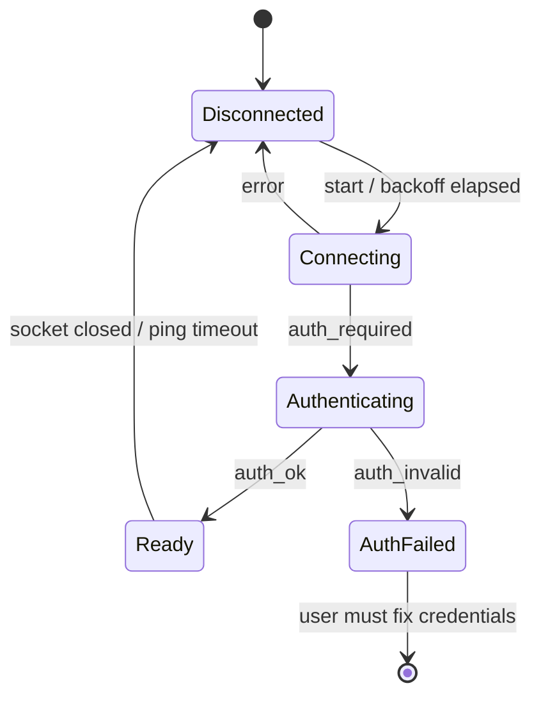

# 03 — Home Assistant integration

Crate: `flick-ha`.
Scope (product decision): Flick controls Home Assistant through **direct service calls only**.
No HA events, MQTT, webhooks, custom integration, or add-on in this scope.
New output types can be added later as additional `ActionSink` implementations.

## 1. Transport decision

| Option | Latency | Two-way | HA-side setup | Device discovery | Verdict |
|---|---|---|---|---|---|
| **WebSocket API** (`/api/websocket`) | lowest (persistent socket) | ✅ `result` acks + subscriptions | none | ✅ states, services, registries | **Chosen** |
| REST API (`/api/services/...`) | + TCP/TLS setup per call (unless keep-alive) | request/response only | none | partial | Fallback only for the "test connection" diagnostic |
| Webhooks | one-way | ❌ | an automation per gesture | ❌ | Rejected |
| HA events / MQTT | low | via automations | automations/broker | ❌ | Out of scope (product decision) |

## 2. Do we need a response from HA?

**Recognition never waits for HA.** The dispatcher sends `call_service` and immediately returns to watching gestures.
The user sees or hears the device react. But Flick **does** read the `result` message that HA sends on the same socket:

1. **Errors the user can't see.** Examples: entity unavailable, HA offline, token revoked, `service_validation_error`.
   → red HUD toast + error earcon + activity log entry.
2. **"Flick understood you" feedback** that doesn't depend on seeing the device. This is critical for accessibility and for remote cameras (Phase 2+).
3. **Latency telemetry** (local only) for the activity log and performance tuning.

HA's WebSocket `call_service` returns `result` **after the service handler finishes**. That is ~10–100 ms for fast local integrations and can be seconds for cloud integrations.

The HUD therefore shows two stages:
- **sent** (instant, when the gesture fires)
- **done ✓ / failed ✗** (on `result`); after **10 s** with no result: "no confirmation".

**State subscriptions** are used only where they add value:
- **Dial mappings** (pinch-dial on brightness, volume, position, fan speed, temperature): subscribe to the target entity so absolute values are computed from the real current state and the HUD shows the live level.
- **Targeted "next / previous level" verbs** (e.g. circling at a fan, `09-…` §5): the current `percentage` / `brightness` decides the next step. Flick subscribes to an anchor's entity **while that device is selected**, plus a 30 s linger, so the value is ready before the verb fires.
- **Teach flow** "Use current speed" reads the live `attributes.percentage` of the device being taught (§6.3.1).
- **Toggles** use HA's own `toggle` services and need no state.
- An optional "show resulting state" HUD line (e.g. "Kitchen light: on") uses the same targeted subscription while a mapping is being tested.

## 3. Connection lifecycle



- URL: `ws://<host>:8123/api/websocket`, or `wss://` for `https` base URLs.
  Use `rustls` with native roots, plus an optional per-instance "trust this certificate" (SHA-256 fingerprint pinning for self-signed HA).
- **Handshake:**
  1. Server sends `{"type":"auth_required","ha_version":"2026.9.x"}`.
  2. Client sends `{"type":"auth","access_token":"<token>"}`.
  3. Server replies `auth_ok` (store `ha_version`) or `auth_invalid` (→ `AuthFailed`; stop retrying and show the UI prompt).
- **Feature negotiation** after `auth_ok`: `{"id":1,"type":"supported_features","features":{"coalesce_messages":1}}`.
- **Message IDs:** strictly increasing `u64` per connection. A `pending: HashMap<u64, oneshot::Sender<Result>>` routes results.
- **Keepalive:** `{"id":N,"type":"ping"}` every **20 s**. No `pong` within **10 s** → close + reconnect.
- **Reconnect:** exponential backoff with full jitter, 0.5 s → 30 s max. On reconnect: re-auth, re-create subscriptions, refresh the registry cache.
- **Stale-action guard:** actions queued while disconnected are **dropped if older than 2 000 ms** (`ha.stale_action_ms`). This prevents a gesture from firing long after the user made it. Dropped actions are logged with status `stale`.
- **Timeouts:** per-request **10 s** (`ha.request_timeout_ms`) → status `timeout`.
- **Min HA version:** 2024.1. Features missing on older versions are detected via error `unknown_command` and degrade gracefully.

## 4. Protocol usage

### 4.1 Service call (hot path)
```json
{"id": 42, "type": "call_service", "domain": "light", "service": "toggle",
 "target": {"entity_id": ["light.living_room"]}, "service_data": {}}
```
- `target` may contain `entity_id`, `device_id`, `area_id`, `floor_id`, `label_id` (arrays).
- Never set `return_response` in MVP. Scripts that return data are called fire-and-forget.
- Success: `{"id":42,"type":"result","success":true,"result":{"context":{"id":"…"}, "response":null}}` → store `context.id` in the activity log.
- Failure: `{"id":42,"type":"result","success":false,"error":{"code":"…","message":"…"}}`.
  Map codes as follows:

| HA error code | Flick status | User-facing message |
|---|---|---|
| `not_found` | `error.not_found` | "Service or device not found — check the mapping" |
| `invalid_format` / `service_validation_error` | `error.invalid` | HA's message verbatim (it is user-readable) |
| `unauthorized` | `error.unauthorized` | "Flick's HA user can't do this" |
| `home_assistant_error` | `error.ha` | HA's message |
| other / socket drop | `error.unknown` / `error.disconnected` | "Home Assistant didn't respond" |

### 4.2 Discovery & pickers (cached; refresh on reconnect and on registry-updated events)

| Command | Purpose |
|---|---|
| `get_config` | location name, version, units, `internal_url`/`external_url` |
| `get_states` | all entities: state, `friendly_name`, `supported_features`, `device_class` |
| `get_services` | domain → service → fields/target schema (advanced editor, validation) |
| `config/area_registry/list`, `config/floor_registry/list`, `config/label_registry/list` | grouping in pickers |
| `config/device_registry/list` | device → area |
| `config/entity_registry/list_for_display` | entity → device/area/labels. Compressed keys (`ei`, `di`, `ai`, `lb`, `en`, `hb`, …); verify in spike P0-05 |
| `subscribe_events` with `event_type` = `entity_registry_updated` / `device_registry_updated` / `area_registry_updated` | cache invalidation |

- Admin-only commands (if a non-admin HA user is used and a command returns `unauthorized`) degrade to `get_states` + `friendly_name`, with no area grouping.
- The teach picker (`09-…` §7) sorts entities by the camera's area. Entities with no area (e.g. `fan.ventilador_dormitorio` today) appear under **No area**, with a hint to assign one in HA. Flick never writes registries.
  The UI shows a hint.
- Cache lives in memory; a snapshot is persisted to SQLite `ha_cache` for instant pickers on the next start (≤ 24 h old; refreshed in the background).

### 4.3 Targeted state subscription (dial, selection, teach, test)
```json
{"id": 57, "type": "subscribe_entities", "entity_ids": ["light.living_room"]}
```
- Parse the compressed stream: `a` (add: `s` state, `a` attributes, `lc`, `lu`), `c` (changes: `+` merges, `-` removes attributes), `r` (removed).
- Keep a `HashMap<EntityId, EntityState>` for subscribed entities only.
- Unsubscribe (`unsubscribe_events` with the subscription id) when no dial mapping, selected anchor, teach session or test session needs the entity.
- Subscriptions are reference-counted per entity, so dial, selection and test users share one subscription.

## 5. Discovery, auth & credentials

### 5.1 Finding HA
- **mDNS:** browse `_home-assistant._tcp.local.` (`mdns-sd`).
  TXT records give `location_name`, `uuid`, `version`, `internal_url`, `external_url`, `base_url`.
  Show a list; de-duplicate by `uuid`.
- Manual entry: URL field with validation (`http(s)://host[:port]`). Try `http://homeassistant.local:8123` as a hint.
- macOS 15+: accessing LAN hosts and Bonjour needs the **Local Network** permission (`NSLocalNetworkUsageDescription`, `NSBonjourServices` = `_home-assistant._tcp`). See `05-…`.

### 5.2 Auth methods
- **MVP — Long-lived access token (LLAT):**
  - The UI deep-links to `<ha>/profile/security` with a 3-step guide.
  - The user pastes the token → Flick connects and verifies (`auth_ok` + `get_config`) → token saved to the **OS keychain**:
    service `app.flick.desktop`, account `ha:<uuid>`.
- **Recommended in the docs:** create a dedicated **non-admin HA user** "Flick" and generate the token from that user.
- **Phase 2 — OAuth (HA auth API, IndieAuth-style):**
  - Preferred loopback flow: `client_id = http://127.0.0.1:<port>/`, `redirect_uri = http://127.0.0.1:<port>/ha/callback`, served by the engine.
    Same host as the client_id, so HA doesn't need to fetch a client_id page.
  - Fallback: custom scheme `flick://ha/callback` with `client_id = https://<flick-domain>/ha-client`, a page containing `<link rel="redirect_uri" href="flick://ha/callback">` (HA must be able to fetch it).
  - Token exchange: `POST /auth/token` (`grant_type=authorization_code`). Refresh (`grant_type=refresh_token`) 60 s before the access token expires (default 1800 s).
  - **Spike required:** confirm HA's client_id validation accepts loopback IP client_ids. If not, use `http://localhost:<port>/`.
- Multiple HA instances: data model supports it; UI supports **one default instance** in MVP.

## 6. Mapping → action resolution

A mapping's action (full schema in `06-…`):

```jsonc
{
  "kind": "call_service",              // or "dial" (§6.2) or "verb" (§6.3, targeted mappings)
  "domain": "light", "service": "toggle",
  "target": { "entity_id": ["light.living_room"] },
  "data": {}                            // service_data
}
```

### 6.1 Friendly action presets (UI → service)

| Domain | Presets | Service |
|---|---|---|
| `light` | Toggle / On / Off / Set brightness / Next scene color | `light.toggle` / `turn_on` / `turn_off` / `turn_on{brightness_pct}` |
| `switch`, `input_boolean` | Toggle / On / Off | `<domain>.toggle|turn_on|turn_off` |
| `fan` | Toggle / On / Off / **Speed level N** / Next speed / Previous speed | `fan.toggle|turn_on|turn_off`; `fan.turn_on{percentage}`; next/prev computed from levels (§6.3), fallback `fan.increase_speed` / `fan.decrease_speed` |
| `media_player` | Play/Pause / Next / Previous / Volume up / Volume down / Mute | `media_play_pause`, `media_next_track`, `media_previous_track`, `volume_up`, `volume_down`, `volume_mute{is_volume_muted:!current}` |
| `scene` | Activate | `scene.turn_on` |
| `script` | Run | `script.turn_on` (fire-and-forget) |
| `automation` | Trigger | `automation.trigger` |
| `cover` (non-sensitive classes) | Open / Close / Stop / Toggle | `cover.open_cover` … |
| `climate` | +1° / −1° | `climate.set_temperature` (computed from subscribed state) |
| `button`, `input_button` | Press | `<domain>.press` |
| Any | Advanced: any service + JSON data | validated against `get_services` fields |

### 6.2 Dial actions (`kind: "dial"`)

| Target | Service sent | Value source |
|---|---|---|
| Light brightness | `light.turn_on {brightness_pct}` | `attributes.brightness` (0–255 → %) |
| Media volume | `media_player.volume_set {volume_level}` | `attributes.volume_level` |
| Cover position | `cover.set_cover_position {position}` | `attributes.current_position` |
| Fan speed | `fan.set_percentage {percentage}` | `attributes.percentage` |
| Climate | `climate.set_temperature {temperature}` (step = target_temp_step or 0.5) | `attributes.temperature` |

- Base value = subscribed state at pinch start; absolute value = clamp(base + gain·delta).
- **Coalescing:** at most **8 calls/s**. Only the latest pending value is sent; always send the final value on `End`.
- If the state isn't known (subscription not ready), use relative services where they exist (`brightness_step_pct`, `volume_up/down`) as a fallback.

### 6.3 Targeted verb actions (`kind: "verb"`)

A targeted mapping (`06-…` §3, `mappings.target_mode` = `anchor` or `domain`) stores a **verb**, not a concrete service. At fire time the dispatcher resolves it against the selected anchor's target (`09-…` §5):

```jsonc
{ "kind": "verb", "verb": "up" }                     // up | down | on | off | stop | toggle | level_set
{ "kind": "verb", "verb": "level_set", "level": 1 }  // explicit level (1-based), e.g. "circle = speed 1"
{ "kind": "dial", "entity_id": "$selected", "property": "percentage" }  // pinch-dial on the selected device (§6.2); property per domain
```

**Resolution table.** The target is an entity, or a device/area expanded to entities of the anchor's domain.

| Verb | `fan` | `light` | `media_player` | `cover` (non-sensitive) | `climate` | `switch` / `input_boolean` |
|---|---|---|---|---|---|---|
| `up` ("on / more") | if off → level 1; else next level | if off → `turn_on`; else `brightness_step_pct: +20` | `volume_up` | `open_cover` | +0.5° (or `target_temp_step`) | `turn_on` |
| `down` ("less") | previous level; below level 1 → `turn_off` | `brightness_step_pct: −20` | `volume_down` | `close_cover` | −0.5° | `turn_off` |
| `on` | `turn_on` | `turn_on` | `media_play` | `open_cover` | `turn_on` | `turn_on` |
| `off` | `turn_off` | `turn_off` | `media_pause` | `close_cover` | `turn_off` | `turn_off` |
| `stop` | `turn_off` | `turn_off` | `media_pause` | `stop_cover` | `turn_off` | `turn_off` |
| `toggle` | `toggle` | `toggle` | `media_play_pause` | `toggle` | — | `toggle` |
| `level_set` N | `turn_on {percentage: levels[N-1]}` | `turn_on {brightness_pct: levels[N-1]}` | `volume_set {volume_level}` | `set_cover_position` | `set_temperature` | — |

**Fan levels** (`anchors.verb_params.levels`, percentages ascending):
- **Default from HA attributes:**
  - `percentage_step = s`, `n = round(100 / s)`.
  - If `n ≤ 10`: levels = `[round(k·s) for k in 1..n]`, with the last level clamped to 100 (e.g. 3-speed → `[33, 67, 100]`). HA maps each percentage to the nearest speed.
- **Fine-step fans** (`n > 10`, e.g. Tuya with `percentage_step: 1.0`):
  - The levels are **taught** ("Use current speed", §6.3.1).
  - Until taught, level 1 = the lowest percentage observed while the device is on (`percentage` from the subscription). If never observed, level 1 = `max(s, 1)`.
- **Next level:**
  1. Take the smallest level strictly greater than the current `percentage` + 0.5·s.
  2. At the top level, stay there and show "Already at max" on the HUD (no wrap-around).
- **Previous level:**
  1. Take the largest level strictly lower than the current `percentage` − 0.5·s.
  2. Below level 1, call `turn_off`.
- **Unknown state** (no subscription yet): `fan.increase_speed` / `fan.decrease_speed` (with `percentage_step` = level spacing when levels are evenly spaced).
- **Feature checks:**
  - Verbs that need `SET_SPEED` (`supported_features & 1`) are hidden for fans without it; `on` / `off` still work.
  - `TURN_ON` (32) and `TURN_OFF` (16) must be supported by the target for those verbs. Otherwise fall back to `toggle`, or show a validation error.

**Worked example** (owner's fan):
- Entity: `fan.ventilador_dormitorio`, `supported_features: 53`, `percentage_step: 1.0`.
- Taught levels: `[1]` (speed 1 currently reports `percentage: 1`).

| Gesture after selecting the fan | Mapping verb | Sent |
|---|---|---|
| ↻ circle (any direction) | `level_set` 1 | `{"type":"call_service","domain":"fan","service":"turn_on","target":{"entity_id":["fan.ventilador_dormitorio"]},"service_data":{"percentage":1}}` |
| ✋✋ two hands separate | `stop` | `{"type":"call_service","domain":"fan","service":"turn_off","target":{"entity_id":["fan.ventilador_dormitorio"]},"service_data":{}}` |

#### 6.3.1 "Use current speed" (teach)
1. The teach UI subscribes to the entity and shows the live value: "Ventilador Dormitorio · on · 1 %".
2. The user sets the speed with the physical remote or the HA app, then taps **Use current speed as level N**.
3. Flick stores `percentage` into `levels[N-1]`. The levels list is kept sorted, and duplicates within 0.5·s are rejected.
4. **Verify:** "Try it: Flick will set level N now" sends `turn_on {percentage}`. After 2 s it re-reads the state and warns if the fan reports a different value, because some integrations quantize percentages.

## 7. Safety policy

Enforced in the dispatcher and in the mapping validator (API rejects invalid mappings with `422`).

| Class | Members | Policy |
|---|---|---|
| **Denied** (cannot be mapped) | `homeassistant.restart`, `homeassistant.stop`, `homeassistant.reload_*`, `hassio.*`, `backup.*`, `recorder.*`, `system_log.*` | Validation error |
| **Sensitive** (off by default) | `lock.*`, `alarm_control_panel.*`, `cover.*` where `device_class ∈ {garage, door, gate}`, `valve.*`, `siren.*`, `shell_command.*`, `rest_command.*` | Allowed only when (1) Settings → Safety → "Allow sensitive devices" is on **and** (2) the mapping has `sensitive_ack=true` **and** (3) a **confirmation gesture** (default `builtin.thumb_up` within 3 s, shown on the HUD) completes the action |
| Normal | everything else | allowed |

- `script.*` / `automation.trigger`: allowed. The UI shows a note that scripts can do anything.
- The global pause, arm mode and quiet hours (Settings) apply before any action is sent.
- **Targeted mappings are classified at resolution time**, with the same policy as the concrete service they resolve to.
  - Teaching an anchor on a sensitive target (e.g. a garage `cover`) shows the lock notice and requires `sensitive_ack` + a confirmation gesture before any verb is enabled for it.
  - Selection by pointing is **not** a confirmation: the confirmation gesture is still required after the verb.
- The OTA catalog pack may add denied/sensitive entries but can never remove them (`10-…` §5.3).

## 8. Dispatcher behavior

1. Receive `GestureEvent(Fired)` → find enabled mappings where gesture, hand, camera, arm state and active hours match.
   - **If `event.target` is set** (a device is selected):
     - Consider only targeted mappings for that anchor, or for "any selected device of domain X".
     - Global mappings for the same gesture are suppressed with `target_selected`.
     - After firing, call `TargetSelector::refresh()`.
   - **If `event.target` is empty**, targeted mappings are skipped (`no_target` is logged only when a targeted mapping exists for the gesture).
   - 0 matches → suppression `no_mapping`.
   - Several matches: all are sent, in `sort_order`, unless `ActionPlanner` (Phase 4) picks one.
   - Targeted verbs resolve to concrete services here (§6.3).
2. Apply cooldown + safety → build `ResolvedAction` → publish `gesture.fired` (HUD) → `ActionSink::execute` (HA client) **without awaiting it** in the gesture path.
3. On outcome → publish `action.result` → update `activity_log` (status, `ha_context_id`, latency breakdown `{detect_ms, dispatch_ms, ha_ms}`).
4. Per-mapping serialization: a new fire for the same mapping while one is in flight **replaces** a pending dial value, or is **dropped** for tap mappings (still in cooldown).

## 9. Testing
- **Mock HA** (`crates/flick-ha/tests/support/mock_ha.rs`): tokio-tungstenite server implementing:
  - `auth_required` / `auth` / `auth_ok` / `auth_invalid`
  - `supported_features`, `ping`
  - `get_config`, `get_states`, `get_services`, the registry lists
  - `call_service` (configurable delay/error)
  - `subscribe_entities` (scripted state changes)
  - forced disconnects
- **Required tests** (the complete list; anything else needs a reason from `07-…` §1.1):
  - handshake: ok and invalid token;
  - reconnect + resubscribe, including the stale-action drop;
  - one table test: HA error codes → `ActionOutcome`;
  - dial coalescing: ≤ 8 Hz and the final value is sent (tokio paused time);
  - the compressed-state parser (`a`/`c`/`r`) on one recorded sample;
  - one table test for the safety validator (a row per rule in §7);
  - one table test for verb resolution + fan levels: a row per row of the §6.3 table and its feature-bit fallbacks, plus a 3-speed fan (`percentage_step: 33.33`), the fine-step `fan.ventilador_dormitorio`, next at max, prev below level 1 → `turn_off`, and unknown state → `increase_speed`.
- Targeted vs global precedence (`target_selected`, `no_target`) is covered by the replay fixtures (`07-…` §1.2), not by separate tests.
- The mock HA scenario `crates/flick-ha/tests/support/scenarios/bedroom_fan.json` mirrors the owner's fan (`supported_features: 53`, `percentage_step: 1.0`, `percentage: 1`, `direction: reverse`).
- **Nightly E2E** (`tools/ha-e2e`): `ghcr.io/home-assistant/home-assistant:stable` with the `demo` integration.
  - A bootstrap script completes onboarding and creates an LLAT via `auth/long_lived_access_token`.
  - Then `flick-engine` with `FLICK_FAKE_CAMERA=tools/fixtures/videos/thumb_up.mp4` must toggle `light.bed_light`, verified via `get_states`.
  - **Targeted E2E:** replay `targeting/point_fan_circle.jsonl` with a seeded anchor bound to a demo fan that supports speeds (e.g. `fan.ceiling_fan`; confirm the demo entity ids in P0-05). Expect `state: on` with `percentage` = level 1. Then replay `point_fan_stop.jsonl` and expect `off`.
