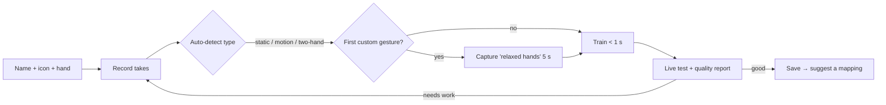
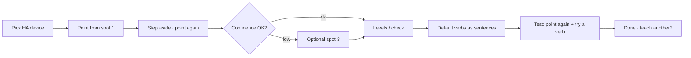

# 04 — Gesture Studio & UX

UI package: `@flick/ui` (React 19 + TS + Vite + Tailwind + shadcn/ui, Lucide icons).
State: TanStack Query (REST), a Zustand store fed by the WS event stream.
Routing: TanStack Router or React Router (pick one at scaffold time and record it in the decision log).
Visual design (palette, type, spacing, motion, component styling) is **not** fixed in this document. It is owned by `DESIGN.md`, produced through the Impeccable process in §0.

## 0. Design process (Impeccable, ADR-018)

The frontend must look and feel modern and distinctive, not like a default component kit. All UI work follows **Impeccable** (impeccable.style, Apache-2.0, a design skill for coding agents). It is bundled in the GitHub Copilot app. Elsewhere, install it with `npx impeccable install`.

| Artifact | Where | Owner | Status |
|---|---|---|---|
| `PRODUCT.md` | repo root | product | ✅ written: users, purpose, principles, a11y |
| `DESIGN.md` (+ sidecar tokens) | repo root | **P1-700** | Created with `/impeccable shape` → new-work before any UI component is built. Defines the visual world, tokens, type scale, motion and component rules |
| Surface briefs | `.impeccable/` (created by the skill) | each UI task | One per surface, with its mode (below) |

**Modes per surface:**
- **Operate:** main window (Home, Gestures, Devices, Mappings, Activity, Settings) and the HUD. The HUD is Operate at a glance, read from 0.5–3 m.
- **Persuade:** a future marketing site. It is out of scope for this repo.
- **Read:** in-app help and docs.

**Workflow per UI task:**
1. Run the Impeccable setup (`context.mjs`), which loads `PRODUCT.md` + `DESIGN.md`.
2. For a new surface, run `shape` first. Then build it against the craft floor.
3. Evaluate with `/impeccable critique <route>` and `/impeccable audit <route>`, plus the detector: `node <impeccable>/scripts/detect.mjs --json ui/src`.
4. Fix every finding in one batch; at most one more verification round.
5. Run `/impeccable polish` on the release candidate before each public release.

**Hard rules:**
- `DESIGN.md` tokens are exported to Tailwind theme variables. shadcn/ui is used for **behavior and accessibility only** and is re-skinned to the tokens. The stock shadcn theme is never shipped.
- Fonts are bundled, license-checked (OFL/Apache) and never loaded from a CDN, because the app works offline.
- Test on every Tauri webview: WKWebView (macOS), WebView2 (Windows) and WebKitGTK (Linux). Avoid CSS features that WebKitGTK doesn't support, or provide fallbacks.
- **HUD legibility at 3 m:**
  - device/action text ≥ 20 px;
  - contrast ≥ 7:1 in high-contrast mode;
  - state must never be conveyed by color alone.
- Motion respects Reduce Motion (`prefers-reduced-motion`). Every animated feedback has a static equivalent.

**UI definition of done** (also in README "Working agreement"). A UI PR includes:
- critique + audit summaries;
- detector JSON with zero unresolved findings (ignores must be justified);
- screenshots: light/dark, 1280 px and 800 px window, and the HUD over a light and a dark wallpaper.

## 1. Design principles
The product principles are in `PRODUCT.md`. These are the UX consequences:
1. **Zero to first flick in under 3 minutes.** Every onboarding screen has one primary action.
2. **Always show what Flick sees.** A live skeleton overlay, a confidence ring and the **selected device** build trust and make tuning easy.
3. **Feedback everywhere:** aiming → selected → fired → sent → done ✓ / failed ✗, in both the HUD and sound.
4. **Safe by default.** Sensitive devices are locked, and the arm mode is explained.
5. **Teach, don't configure.** Gestures are recorded and devices are shown by pointing. Forms are the fallback.
6. **Accessible.** Keyboard-navigable, screen-reader labels, respects Reduce Motion and contrast settings. Sounds and HUD can be toggled independently.
7. **Friendly copy.** Short, human, no jargon ("landmarks" → "hand points", "anchor" → "taught device").

## 2. Information architecture

```
Tray menu ─┬─ Pause / Resume
           └─ Open Flick ─┬─ Home (dashboard)
                          ├─ Gestures ── Gesture Studio (record static / motion / two-hand)
                          ├─ Devices ── Teach a device (point) · Places (per camera) · Re-align
                          ├─ Mappings ── Mapping editor (global · targeted)
                          ├─ Cameras
                          ├─ Activity (+ "Why didn't it fire?" debug)
                          ├─ Settings (General · Detection · Pointing · Safety · Feedback · Privacy · Home Assistant · Updates · Advanced)
                          └─ Pro (Phase 3)
HUD overlay (separate window)
```

## 3. Onboarding (first run)

| Step | Screen | Primary action | Details |
|---|---|---|---|
| 1 | **Welcome** | "Get started" | 3 promises with icons: *Private* (video never leaves this Mac), *Instant*, *No training needed* |
| 2 | **Camera** | "Allow camera" | Explains why. Triggers the macOS prompt. Then a live preview with a skeleton overlay: "Show me your hand ✋". The check passes when a hand is tracked for 1 s. Camera picker if several cameras exist |
| 3 | **Home Assistant** | "Connect" | Auto-discovered instances as cards (name, URL, version); "Enter address manually". Then the token step: button "Open my HA profile" (deep link `<ha>/profile/security`), a 3-step mini-guide (with an animated image), a paste field. Tip: "Create a separate HA user for Flick". Verifying shows a spinner, then "Connected to *Home* (2026.9)" |
| 4 | **Your first flick** | "Try it" | Suggested mapping: 👍 Thumbs up → toggle a light. The entity picker is filtered to `light.*`, grouped by area; the most likely light is preselected (area with the most lights). The user does 👍; the HUD shows the result live; success earcon + subtle confetti (off when Reduce Motion is on) |
| 5 | **Point at a device** (optional) | "Teach a device" / "Later" | "Point at something in this room — like the ceiling fan — and Flick will remember it." Runs the Teach flow (§6b) for one device. It ends with a real "point + ↻" test |
| 6 | **Stay in control** | "Finish" | Short explainer cards: pause from the menu bar / `⌥⌘F`; optional arm mode toggle; "sensitive devices (locks, alarms, garage) are blocked unless you allow them" |
| 7 | Done | — | "Flick is watching from the menu bar". The main window closes to the tray. Autostart is on (the toggle is shown) |

- Each step is skippable except Camera. Skipping HA gives a "Demo mode": gestures show in the HUD without sending actions.
- Telemetry: none. Onboarding completion is stored locally (`onboarding.completed`).

## 4. Home (dashboard)
- **Status cards:**
  - Camera: name, fps, state
  - Home Assistant: state, version
  - Engine: inference ms p95, "Watching / Idle / Paused"
  - Place: current place name for the camera ("Bedroom desk") with an OK / "Camera moved — re-align" state
- **Live preview** (collapsible): MJPEG stream + canvas overlay with the hand skeleton, track IDs, current top gesture + confidence ring.
  - When pointing, the overlay also shows the pointing ray and the hovered or selected device label.
  - The overlay is drawn from `hands:<camera_id>` and `target.*` WS events (15 Hz), not burned into the video.
- **Update banner** (only when relevant): "Flick 1.3 is ready — restart to update" or "Hand model improved (v3)", with a link to the changelog.
- **Recent activity** (last 10) with status icons, and a link to Activity.
- **Quick actions:** Pause 15 min · Add mapping · Record gesture.

## 5. Gestures library
- Grid of cards in 2 sections:
  - **Built-in:**
    - static: the 7 canned gestures + point;
    - motion: 4 swipes, circle ↻/↺, pinch-dial;
    - two-hand: separate ("stop").
  - **Custom:** static, motion and two-hand gestures, each with a type badge.
- Card: animated glyph (static fallback under Reduce Motion), name, hand constraint, enabled toggle, "used by N mappings".
  - Custom cards add: take count, accuracy %, distinctiveness warning.
  - Catalog-pack updates (`10-…` §5.3) show a subtle "tuned in v4" note on built-ins whose defaults changed.
- Actions: Record new gesture · Import pack · Export selected.

## 6. Gesture Studio (custom static, motion and two-hand gestures)



1. **Setup:** name ("Rock on", "Zorro Z"), emoji/icon picker, hand: Any (default) / Left / Right. Camera selector.
   - The user doesn't pick a type up front. Flick detects it from the first takes (`02-…` §4.4).
2. **Record takes.** Static: default **5 takes**, max 20. Motion / two-hand: **3–5 takes** of up to 2 s each.
   - **Per take:**
     - A 3-2-1 countdown with earcon ticks.
     - Static: "Hold it…" with a progress ring (1.5 s).
     - Motion: "Go!" with a 2 s capture bar. The trajectory is drawn as a fading trail over the skeleton.
   - The skeleton turns green while frames are accepted, and amber if the hand is partially out of frame.
   - **Type chip** after take 1: "Looks like a **motion** gesture · change". The user can override it; the chip stays visible.
   - **Motion takes** are shown as small **trajectory glyphs** (normalized paths). Two-hand takes show two colored paths. The user can overlay all takes to see their consistency.
   - **Coaching between takes** (rotating): "Step back a little", "Turn your hand slightly", "Try the other hand" (if hand = Any), "Move to the side of the frame". For motion: "Same shape, a bit faster/slower".
   - **Quality meter** per take: hand fully visible · steady (static) / smooth path (motion) · different from previous takes (diversity). Bad takes can be re-recorded with one click.
   - Take thumbnails are **rendered skeletons or trajectories** (from landmarks), never camera images.
3. **Relaxed-hands capture** (first time only): "Now just move naturally for 5 seconds — wave, scratch your head, relax." This collects `system.none` negatives for both static and motion matching.
4. **Train:** instant (`POST /classifier/train` for static; template build for motion). Show "Learned in 0.3 s".
5. **Live test:**
   - Big confidence bar for the new gesture, plus the top-2 other gestures.
   - A threshold slider (default 0.75 static; motion shows a DTW match-strength scale) with a marker for the current value.
   - **Quality report:**
     - accuracy (leave-one-take-out);
     - distinctiveness;
     - nearest confusable gesture, e.g. "Looks a bit like ✌️ Victory (62 %)" or "Your Z looks like swipe right". The report ends with "add 3 more takes or pick a more distinct shape".
6. **Save:** shows "Use it as a device verb or a global gesture?" and opens the Mapping editor with the gesture preselected.

Target: a custom static gesture in ≤ 60 s, and a custom motion or two-hand gesture in ≤ 90 s.

## 6b. Teach a device (point to select, `09-…` §7)

Entry points: Devices → "Teach a device"; onboarding step 5; the empty state of a targeted mapping; the HUD "Unknown device? Teach it" action (Phase 2).



| Step | Screen | Details |
|---|---|---|
| 1 | **Pick the device** | Search HA entities/devices, sorted by the camera's area. Entities with no area are listed under "No area", with a hint to assign one in HA. Each row shows the live state. Phase 2: "Suggest devices I can see" |
| 2 | **Point from spot 1** | Big live preview with the ray drawn from eye → fingertip. Copy: "Point at **Ventilador Dormitorio** and hold still". A 1 s ring fills while the ray is steady (< 2° jitter). The capture shows as a pinned ray |
| 3 | **Point from spot 2** | "Take one or two steps to the side and point again". After capture: a **confidence meter** (triangulation angle + residual) and a plain verdict: "Great — Flick knows where it is" or "Try a spot farther to the side". Spot 3 is optional |
| 4 | **Levels** (fine-step fans) | Live readout "on · 1 %". "Set your fan to speed 1 with its remote or the HA app, then tap **Use current speed**." There is "+ Add speed 2" and a "Try level 1" test (`03-…` §6.3.1). Other domains: skipped, or a one-tap "check it responds" |
| 5 | **Verbs** | Default verbs shown as editable sentences: "Point + ↻ → speed 1", "Point + ✋✋ apart → off", "Point + 👍 → on". Each has a toggle, a gesture swap, and "Record a new gesture" (opens the Studio and returns here) |
| 6 | **Test** | "Point at it again": the HUD shows the selection + angular error ("4° off — great"). "Try a verb" sends a real call and shows done/failed inline |

- **Distinctiveness warning:** if another taught device is < 15° away as seen from this camera, show "This is close to *Bedroom lamp*. Point more deliberately, or teach from another spot."
- **Re-align flow** (from a `needs_realign` notice): "The camera moved. Point at **Ventilador Dormitorio**…" and then a second known device. It shows the residual. If the residual is > 10°: "Re-teach these devices".
- **Devices list:** cards grouped by place. Each card shows:
  - the HA name + domain icon;
  - status (OK / needs re-align);
  - the taught verbs;
  - last used;
  - "Re-teach" and "Delete" actions.
  - A small top-down **room sketch** (camera + anchor directions) helps users understand spacing. It is decorative and labelled for screen readers as a list.
- Target time: **≤ 90 s per device** (acceptance, §12).

## 7. Mappings

### 7.1 List
- Two tabs: **Devices** (targeted mappings, grouped by taught device) and **Global** (gesture → action anywhere).
- Rows read as sentences:
  - Global: **"👍 Thumbs up (right hand) → Toggle *Living room lights*"**.
  - Targeted: **"Point at *Ventilador Dormitorio* + ↻ → Speed 1"**.
  - Each row has an enabled toggle, a mode badge (tap/hold/repeat/dial), a camera badge, and a sensitive 🔒 badge.
- Drag to reorder (`sort_order`). Search/filter by gesture, area, domain, device.
- **Conflict warnings:**
  - The same gesture + hand + camera used by several mappings → info badge "fires 2 actions".
  - A global mapping on a gesture that is also a device verb → info "Suppressed while a device is selected".

### 7.2 Editor (sentence builder)
- Global: `When [gesture ▾] with [any hand ▾] on [all cameras ▾] → [action ▾] on [target ▾]`
- Targeted: `When I point at [taught device ▾ | any <domain> ▾] and [gesture ▾] → [verb ▾]`
  - The verbs come from `03-…` §6.3 (Speed level N / Next / Previous / On / Off / Stop / Toggle / Dial). Levels are labelled with their taught values ("Speed 1 · 1 %").

- **Target picker:** search across areas, devices, entities, scenes, scripts, grouped by area/floor. Shows each entity's current state.
- **Action picker:** presets per domain (`03-…` §6.1). "Advanced" reveals a raw service picker plus a JSON data editor with field hints from `get_services`.
- **Behavior** (collapsible):
  - Mode: tap / hold (ms) / repeat (interval) / dial (for supported targets)
  - Cooldown
  - Require arm
  - Active hours
  - Feedback (HUD/sound)
- **Sensitive targets:**
  - The editor shows a lock notice. The mapping can't be enabled unless Settings → Safety → "Allow sensitive devices" is on.
  - The user checks "I understand" (`sensitive_ack`) and picks a confirmation gesture (default 👍).
- **Test button:** fires the action now (`POST /mappings/{id}/test`) and shows the result inline.
- Validation errors come from the API `422` `problem+json`, shown inline with the field.

## 8. HUD overlay

Small pill (360×96, rounded, blurred translucent background; high-contrast option).

| State | Visual | Sound (default on) |
|---|---|---|
| Aiming | Thin ring around a device glyph + name of the hovered device ("Ventilador Dormitorio?") filling over the 500 ms dwell | — |
| Selected | Device name + domain icon, a 4 s countdown bar, verb hints ("↻ speed 1 · ✋✋ off") | soft "lock-on" |
| Ambiguous | "Two devices here — point more precisely" | — |
| Candidate | Gesture icon with a filling ring (vote progress) | — |
| Armed | Soft glow + "Listening… 4 s" countdown | soft "whoosh" |
| Fired / sent | Icon + "Living room lights → Toggle" (targeted: "Ventilador Dormitorio → Speed 1") | "tick" |
| Done ✓ | Green check + optional resulting state ("on") | "chime" |
| Failed ✗ | Red × + short reason ("Light unavailable") | "buzz" |
| Confirm needed | 🔒 "Confirm with 👍 within 3 s" + countdown | double "tick" |
| Dial | Horizontal bar with value (e.g. 64 %) and entity name | subtle ticks every 10 % (optional) |
| Camera moved | "Camera moved — re-align your devices" (tap opens Re-align) | — |
| Paused | "Flick paused — until 14:30" (shown for 2 s when pausing) | — |
| Update ready | Shown only in the main window and tray, **never in the HUD**: "Restart to update" | — |

- Auto-hide after `feedback.hud.duration_ms` (1.5 s) after the last update. Never takes focus; click-through.
- Earcons: short (< 250 ms), original sound files (CC0/self-made) in `ui/public/sounds/`. Played in the HUD webview with Web Audio. Volume in settings.
- Screen reader: optional live-region announcements of results from the main window, when open (`aria-live="polite"`).

## 9. Activity & debugging
- Table: time, camera, gesture (+ confidence), mapping, action, status icon, latency breakdown (detect / dispatch / HA) on hover.
- Filters: status, gesture, mapping, time range. Export CSV.
- **"Why didn't it fire?" mode** (toggle; enables `debug.log_suppressed`):
  - Live list of suppressed candidates with a plain-English reason (one message per reason code in `02-…` §5; examples):
    - "Confidence 0.61 below 0.75"
    - "Cooling down (0.4 s left)"
    - "Not armed"
    - "No mapping for 🤘 with left hand"
    - "Locks are blocked in Safety settings"
    - "Hand too far — move closer"
    - "A device was selected, so the global 👍 mapping was skipped" (`target_selected`)
    - "Circle is a device verb — point at a device first" (`no_target`)
    - "Two taught devices were too close to tell apart" (`ambiguous_target`)
    - "Camera moved — re-align to use pointing" (`needs_realign`)
  - A button next to a confidence suggestion: "Lower threshold for this gesture to 0.65".

## 10. Settings

| Section | Controls |
|---|---|
| General | Start at login; language (i18n: English first, via `i18next`); theme |
| Detection | Sensitivity preset (Low / Normal / High); advanced: vote N-of-M, min hand size; battery saver; arm mode (gesture, hold, window); pause gesture; two-hand "stop" axis (any / vertical / horizontal) |
| Pointing | Enable pointing (on when ≥ 1 device is taught); aim tolerance (10°, 5–15°); dwell (500 ms); selection window (4 s); show ray in the preview; places per camera + "Re-align now" |
| Safety | Allow sensitive devices (off); confirmation gesture; quiet hours |
| Feedback | HUD on/off, position, duration, high contrast; sounds on/off, volume; test buttons |
| Privacy | Pause when HA offline (on); pause on screen lock (off); keep Mac awake while watching (off); "Delete all gesture data"; "Delete all taught devices"; "What Flick stores" explainer |
| Home Assistant | Instance, status, version, re-auth, disconnect; "Use a non-admin user" tip |
| Updates | Channel (Stable / Beta / Nightly); install app updates automatically (on) · when idle (on); update models & gesture catalog automatically (on); current versions of the app and each pack; "Check now"; "Roll back model"; "Import offline update…" (`.flickupdate`); link to the changelog (`10-…` §8) |
| Cameras | List/add (local; RTSP in Phase 2), mirror, rotation, fps, max hands, ROI drawing on preview |
| Advanced | Execution provider (Auto / CoreML / CPU…) + re-run benchmark; engine logs; diagnostics bundle; reset app |

## 11. Visual & content guidelines
- **Visual identity** (palette, typography, iconography style, motion language, light/dark themes) is defined in `DESIGN.md` by **P1-700** (§0). **Nothing in this spec pins a color or font.** An earlier draft used a coral accent as a placeholder; it is not a commitment.
- **Fixed constraints** that DESIGN.md must respect:
  - dark and light themes;
  - a high-contrast mode for the HUD;
  - legible from 3 m (§0);
  - one consistent, custom gesture glyph set: built-ins, swipes, circles, pinch-dial, point, two-hand "stop";
  - device-domain icons.
- **Copy examples:**
  - Empty mappings: "No mappings yet. Pick a gesture and tell Flick what it should do."
  - HA offline: "Can't reach Home Assistant. Flick will keep trying — your camera is paused meanwhile."
  - Camera denied: "Flick needs camera access to see your gestures. Video stays on this Mac."
  - No devices taught: "Point at something in the room — Flick will remember it."
  - Camera moved: "Your camera moved, so pointing is paused. Point at two devices you taught to fix it."
- **Accessibility checklist per screen:**
  - all controls reachable by keyboard; visible focus ring
  - labels on icon buttons
  - contrast ≥ 4.5:1
  - no information conveyed by color alone (icons + text on statuses)
  - Reduce Motion disables confetti and ring animations (static progress text)

## 12. UI acceptance criteria (MVP)
- Onboarding completes in ≤ 3 min in usability tests with 5 HA users (median), with no facilitator help.
- A new custom static gesture is recorded, trained and used in ≤ 60 s; a motion or two-hand gesture in ≤ 90 s.
- A device is taught (pick → 2 spots → verbs → successful test) in ≤ 90 s (median, 5 users). The owner's scenario works end to end: point at `fan.ventilador_dormitorio` + ↻ → speed 1, and point + ✋✋ apart → off.
- Every action outcome is visible in the HUD within 100 ms of the corresponding WS event. The selected-device state appears within 100 ms of `target.selected`.
- Lighthouse accessibility score ≥ 95 on each main route (UI served by Vite against `flick-engine --dev`; see `07-…` §2).
- Impeccable `critique` + `audit` pass and the detector reports zero unresolved findings for every route (§0).
- The 5 Playwright journeys in `07-…` §1.2 pass (onboarding, custom gesture, Teach + the fan scenario, sensitive mapping, update ready). Other screens are checked manually and through the Impeccable review; no component or snapshot tests.
