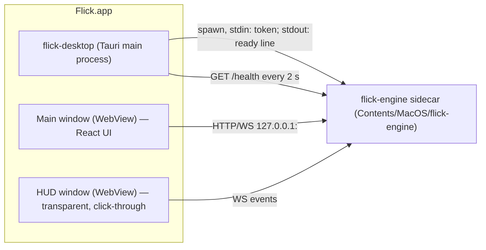

# 05 — Desktop app & distribution

Crate: `flick-desktop` (`apps/desktop/src-tauri`), UI package `@flick/ui` (`ui/`).
Tauri 2 (baseline 2.12). Bundle identifier: **`app.flick.desktop`** (placeholder until the domain is confirmed).

## 1. Process model

- The **engine is a Tauri sidecar** (`bundle.externalBin: ["binaries/flick-engine"]`, built per target triple).
- **Startup handshake:**
  1. The shell generates a 256-bit random token.
  2. It spawns `flick-engine --sidecar --port 0 --data-dir <app data>` and writes the token as the **first stdin line** (never in argv/env).
  3. The engine binds `127.0.0.1:0` and prints one JSON line on stdout: `{"event":"ready","port":53211,"version":"0.1.0"}`.
  4. The shell stores `{base_url, token}` and exposes them to webviews via the IPC command `engine_endpoint`.
- **Supervisor:**
  - If `/health` fails 3 times or the process exits, restart with backoff 0.5 s → 10 s.
  - The UI shows a banner "Engine restarting…".
  - After 5 crashes in 2 min, stop and show "Flick engine keeps crashing". Offer a diagnostics bundle.
- **Shutdown:** the shell sends `SIGTERM` (Windows: `CTRL_BREAK`/job-object kill) and waits 3 s. The engine closes cameras and the HA socket cleanly.

### 1.1 Tauri IPC commands (keep minimal; everything else goes through the engine HTTP API)

| Command | Purpose |
|---|---|
| `engine_endpoint() -> {base_url, token}` | Bootstrap the API client |
| `show_main_window(route?: string)` | Open/focus the main window (from tray, HUD, deep link) |
| `set_hud_config({position, enabled})` | Position/show the HUD window |
| `open_external(url)` | Open the HA profile page, docs (via `tauri-plugin-opener`) |
| `app_info() -> {version, platform, arch, pro}` | About screen |
| `app_update_status() -> {state, available?, downloaded?, rollback_to?}` | Settings → Updates and the update banner (`10-…` §4) |
| `app_update_check()` | "Check now" |
| `app_update_restart()` | "Restart to update". The shell first asks the engine whether it is busy (`GET /updates` → `busy_reason`) and refuses during a confirmation, Studio recording, Teach session or dial interaction |
| `app_update_rollback()` | Starts the assisted downgrade (`10-…` §4.3) |

Tauri capabilities: the main window gets `core:default`, `opener:allow-open-url` (limited to `https://*` and the configured HA base URL), `notification:default`.
The updater is driven **only from Rust**, so the rollout/revocation `version_comparator` can't be bypassed from a webview. Webviews get no `updater:*` permission.
The HUD window gets only `core:event:default`.

## 2. Windows

| Window | Properties |
|---|---|
| `main` | 1100×720, min 900×600, hidden at login (tray app), `titleBarStyle: "Overlay"` on macOS, remembers position (`tauri-plugin-window-state`) |
| `hud` | 360×96, `transparent: true`, `decorations: false`, `alwaysOnTop: true`, `skipTaskbar: true`, `focus: false`, `set_ignore_cursor_events(true)`, visible on all workspaces. Position presets: top-center (default), top-right, bottom-center, bottom-right. Shown only while there is something to show |

- Transparent windows on macOS need `app.macOSPrivateApi: true`. This is acceptable because distribution is outside the Mac App Store.
- **macOS activation policy:** `Accessory` (menu-bar only, no Dock icon) while only the HUD/tray is active.
  Switch to `Regular` when the main window opens, and back when it closes.
- **Menu bar mode** (Settings → General → "Keep in menu bar", default **on**, stored in `shell_prefs.json` in the app config dir).
  On: closing `main` hides it and switches to `Accessory`, and the tray icon stays visible. Off: the tray icon is hidden, closing `main` keeps the Dock icon, and clicking the Dock icon reopens the window (`RunEvent::Reopen`). The yellow minimize button always minimizes to the Dock, per the Apple HIG.
- **Tray icon:** a single monochrome template image (`icon_as_template(true)`), so macOS tints it for light, dark and highlighted menu bars. No colour.
- **Window dragging:** the sidebar inset and the toolbar use `data-tauri-drag-region`, which needs `core:window:allow-start-dragging` in the `main` capability.

## 3. Tray / menu bar

- Icon states (template images on macOS):

| State | Icon |
|---|---|
| Watching | filled hand |
| Idle (no hand) | outline hand |
| Paused | hand with slash |
| Needs attention | red dot (HA auth failed, camera error, engine crash, camera moved) |
| Update ready | small accent dot (lower priority than "needs attention") |

- Menu:
  1. Status line ("Watching — Living room webcam · HA connected")
  2. **Pause** ▸ 15 min / 1 hour / Until I resume
  3. Resume
  4. Open Flick
  5. Gesture Studio
  6. Activity
  7. Settings…
  8. **Restart to update (1.3.0)**, shown only when an update is downloaded; otherwise "Check for updates"
  9. Quit Flick (installs a pending update on quit)
- **Global shortcut** (`tauri-plugin-global-shortcut`): `⌥⌘F` / `Ctrl+Alt+F` toggles pause (configurable).

## 4. Plugins

| Plugin | Use |
|---|---|
| `tauri-plugin-single-instance` | Focus the existing instance; forward deep links |
| `tauri-plugin-deep-link` | `flick://` scheme: `flick://open/<route>`, `flick://ha/callback` (OAuth fallback, Phase 2), `flick://pack?url=` (import pack, Phase 2) |
| `tauri-plugin-autostart` | Settings → General → "Open at login" (macOS LaunchAgent, Windows Run key, Linux XDG autostart). Default **off**. Login launches pass `--hidden`, so the window stays closed and Flick starts in the menu bar (or the Dock when menu bar mode is off) |
| `tauri-plugin-updater` | Signed app updates, driven from Rust (`10-…` §4). Minisign key from `tauri signer generate`, kept in Key Vault. Endpoints: primary `https://updates.flick.app/app/{{target}}/{{arch}}/{{current_version}}?channel=<ch>` (Azure Blob + Front Door, placeholder domain), then the GitHub Releases `latest.json` mirror. Channels: `stable`, `beta`, `nightly`. A custom `version_comparator` applies the signed channel index (rollout %, revoked, rollback). Install on quit by default |
| `tauri-plugin-notification` | System notifications for important errors when the HUD is disabled |
| `tauri-plugin-global-shortcut` | Pause toggle |
| `tauri-plugin-window-state` | Main window geometry |
| `tauri-plugin-opener` | External links |

## 5. macOS specifics (MVP platform)

- **Target:** macOS **13 Ventura+**, **Apple Silicon** (`aarch64-apple-darwin`). Intel (`x86_64`) Macs in Phase 2 (universal build) if demand justifies it.
- **Info.plist keys:**

| Key | Value |
|---|---|
| `NSCameraUsageDescription` | "Flick uses the camera to recognize your hand gestures. Video never leaves this Mac." |
| `NSCameraUseContinuityCameraDeviceType` | `true` (list iPhone Continuity Camera) |
| `NSLocalNetworkUsageDescription` | "Flick connects to Home Assistant and your cameras on your local network." |
| `NSBonjourServices` | `["_home-assistant._tcp"]` |
| `LSApplicationCategoryType` | `public.app-category.utilities` |

- **Hardened runtime entitlements:** `com.apple.security.device.camera`. Any others found necessary in spike P0-06 must be listed here with a reason.
  Not sandboxed (outside the App Store).
- **TCC attribution:** the sidecar is launched by the app, so camera and Local Network permissions are attributed to **Flick.app** (the responsible process).
  Spike P0-04/P0-06 **must verify** that the prompt shows "Flick" and the grant persists across updates.
- **Permission UX:** the engine reads `AVCaptureDevice.authorizationStatus` (via `objc2-av-foundation`) and reports it in `/status` as `camera_permission` (`authorized` | `denied` | `not_determined` | `restricted`).
  If denied, the UI shows a deep link to `x-apple.systempreferences:com.apple.preference.security?Privacy_Camera`.
- **Sleep/wake:** on system sleep, stop capture; on wake, resume after 2 s. Optional `privacy.keep_awake` holds an `IOPMAssertion` (`PreventUserIdleSystemSleep`) while watching.
- **Screen lock:** capture continues by default (living-room use). The `privacy.pause_on_screen_lock` option exists. Verify capture behavior while locked in P0-04.
- **Signing & notarization:**
  - "Developer ID Application" certificate.
  - `tauri build` with `APPLE_SIGNING_IDENTITY`, then notarize via App Store Connect API key (`APPLE_API_KEY`, `APPLE_API_ISSUER`, `APPLE_API_KEY_PATH`).
  - Staple the ticket. The sidecar, ONNX Runtime dylib and FFmpeg dylibs must all be signed with the same identity.
- **Artifacts:** `Flick_<ver>_aarch64.dmg` + `Flick.app.tar.gz` (+ `.sig`) for the updater.
- **Update + TCC:** the camera grant must survive updates. This requires the same Team ID, bundle id and designated requirement across versions. It is checked in the release checklist and in the P0-06 spike.

## 6. Windows & Linux (CI from day one, polished in Phase 2)

| | Windows | Linux |
|---|---|---|
| Min version | Windows 10 22H2 / 11 (WebView2 evergreen) | Ubuntu 22.04+ / Fedora 39+ (webkit2gtk-4.1) |
| Camera | Media Foundation (via `nokhwa`) | V4L2 |
| Inference EP | DirectML, then CPU | CUDA (optional), then OpenVINO, then XNNPACK, then CPU |
| Local network | No prompt expected (outbound only); headless LAN mode triggers a Windows Firewall prompt | n/a |
| Secrets | Windows Credential Manager | Secret Service (libsecret). If unavailable: file `secrets.json` with `0600` + warning |
| Installer | NSIS `.exe` (+ MSI optional) | AppImage, `.deb`, `.rpm` |
| Signing | **Azure Artifact Signing** (formerly Trusted Signing; Basic ≈ $9.99/month) from the first Windows preview build. Verify identity-validation eligibility in P0-09. The updater `.sig` uses minisign | AppImage signature (optional); `.deb`/`.rpm` repo signed with GPG in Phase 2 |
| Autostart | Run key | XDG autostart |
| Tray | native | AppIndicator (`libayatana-appindicator`) |

## 7. Headless mode (Phase 3)
- `flick-engine --headless --data-dir /var/lib/flick --port 7870` serves the same UI (embedded with `rust-embed` from `ui/dist`) at `/`.
- Default bind stays `127.0.0.1`. LAN access requires `--bind 0.0.0.0` **and** pairing: the console prints a 6-digit code, the browser exchanges it for a device token, and TLS uses a self-signed certificate with fingerprint display.
- Packaging:
  - Homebrew formula (`brew install flick-engine`, launchd service)
  - `.deb` with a systemd unit
  - Docker image `ghcr.io/<org>/flick-engine` (CPU + CUDA variants)
  - Windows service (NSSM-free, via `windows-service` crate)

## 8. CI/CD (GitHub Actions)

| Workflow | Trigger | Jobs |
|---|---|---|
| `ci.yml` | PR, push to `main` | `rust-lint` (fmt, clippy `-D warnings`), `rust-test` (matrix: macos-14 arm64, windows-latest, ubuntu-22.04), `ui` (pnpm install, lint, typecheck, vitest), `ui-design` (Impeccable detector `--json` on `ui/src`; fails on unresolved findings, `04-…` §0), `api-drift` (`cargo xtask gen-api` → no diff), `deny` (cargo-deny licenses/advisories), `build-bundles` (tauri build, unsigned, all 3 OSes; upload artifacts) |
| `nightly.yml` | cron 02:00 UTC | `ha-e2e` (docker HA demo + fake camera + targeted fan replay), `bench` (macos-14; fails on > 20 % regression vs baseline JSON), `fixtures` (vision parity + false-trigger replay) |
| `release.yml` | tag `v*` | build + sign + notarize macOS; build Windows (Artifact Signing) and Linux; generate updater `latest.json` + minisign signatures; upload to Azure Blob (`app/<version>/…`) + GitHub Release (draft); SBOM (`cargo cyclonedx` + `pnpm sbom`); sign and publish `channels/nightly/index.json`. Promotion to beta/stable is a separate, approved metadata job (`10-…` §7) |
| `release-dryrun.yml` | before each release tag (required by `release.yml`), or manual (macOS) | build signed test versions N−1 and N with test keys → install N−1 → update to N via `serve-updates` → health check → simulated failure → rollback + DB restore (`07-…` §1) |
| `models.yml` | manual / tag `models-*` | convert/quantize → golden + benchmark on 3 OSes → build + sign the pack → publish to nightly (`10-…` §5, §7) |

- Caching: `Swatinem/rust-cache`, pnpm store, model cache keyed by `models/manifest.toml` hash.
- Secrets (GitHub environments with required reviewers for `release` and `promote`):
  - `APPLE_*`
  - **No long-lived Azure secrets.** GitHub OIDC federated credentials → Azure (Key Vault, Blob, Artifact Signing). Key Vault holds:
    - the Tauri minisign private key + password;
    - the Flick `targets` ed25519 key.
  - The Flick `root` key is **offline** (hardware tokens, 2 of 3) and never in CI.
  - `FLICK_PRO_DEPLOY_KEY` (Phase 3, to fetch the private crates)

## 9. Versioning & updates
- SemVer. `0.x` during beta. The engine and desktop share one version; a mismatch refuses to start with a clear error.
- DB migrations follow `06-…` §8. A snapshot of `flick.db` (`backups/flick-<old_version>-<ts>.db`) is taken before installing an update and before migrating.
- Full OTA behavior (checks, channels, staged rollout, model/catalog packs, health check, rollback, offline import) is in **`10-ota-updates.md`**. Models and the gesture catalog update without an app update.
