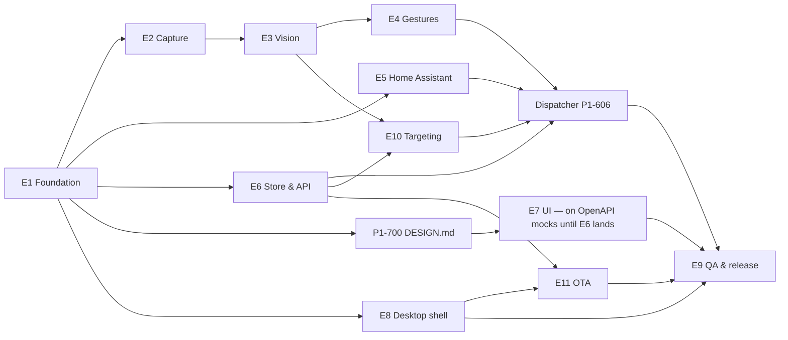

# 08 — Roadmap & work breakdown

Task format:
**`ID` Title** · size · deps
- **Scope:** what to build (spec sections are normative)
- **AC:** acceptance criteria (all must pass). Show each one with an existing test, a replay fixture, a nightly metric or a manual check noted in the PR. New tests follow the lean policy in `07-…` §1.1: only what a senior engineer would write, never tests for trivial or unused code

Sizes:
- **S** ≤ 1 agent-day
- **M** 2–3 days
- **L** 4–5 days. Split anything bigger.

ID scheme: `P<phase>-<epic><nn>` (e.g. `P1-1003` = Phase 1, epic E10, task 03; `P1-700` = E7 task 00, the design task that precedes all other UI work).

## Parallel lanes (Phase 1)

Lanes that can run in parallel after E1:
- **Vision** (E2→E3→E4)
- **HA** (E5)
- **Store/API** (E6)
- **Design → UI** (P1-700, then E7 using MSW mocks generated from OpenAPI)
- **Desktop** (E8)
- **Targeting** (E10, starting after P0-08 with the geometry work on synthetic data)
- **OTA** (E11, starting with signed metadata + a local update server)

---

## Phase 0 — Spikes (≈ 1–2 weeks). Goal: kill technical risk before building

Each spike ends with a short report in `docs/spikes/P0-xx.md` (findings, numbers, decision). Decisions update `01-architecture.md` §10.

**`P0-01` Repo scaffold** · S · —
- **Scope:** layout from `01-…` §6, workspace lints, `rust-toolchain.toml`, `deny.toml`, pnpm workspace for `ui/`, minimal `ci.yml` (fmt, clippy, test on 3 OSes).
- **AC:** CI green on an empty skeleton on macOS/Windows/Linux.

**`P0-02` Model conversion & parity** · L · P0-01
- **Scope:** `tools/training/convert.py` (uv project) → ONNX for the 4 models in `02-…` §2; inspect tensor names/shapes; compare against PINTO/Qualcomm ports; `parity.py` against the MediaPipe Python reference on 3 fixture videos.
- **AC:** `models/manifest.toml` filled with sha256 and I/O specs; landmark mean error ≤ 0.01; Tier 0 agreement ≥ 97 %; licenses of the chosen sources recorded.

**`P0-03` Inference benchmark** · M · P0-02
- **Scope:** Rust bench with `ort` 2.x on M1/M2: CoreML vs XNNPACK vs CPU per model; also DirectML (Windows runner) and CPU (Linux).
- **AC:** report with p50/p95 per model/EP; proves palm ≤ 4 ms and landmarks ≤ 4 ms p95 on M1 with at least one EP; decides the default EP order.

**`P0-04` Camera capture** · M · P0-01
- **Scope:** `nokhwa` on macOS (built-in + Continuity Camera), Windows MF, Linux V4L2; NV12→RGB cost; TCC attribution when launched as a child process; behavior while the screen is locked / display asleep.
- **AC:** 720p30 capture on all 3 OSes; decision on `MacNativeSource` fallback; TCC findings documented.

**`P0-05` HA WebSocket client** · M · P0-01
- **Scope:** auth, `call_service`, `get_states`, `config/entity_registry/list_for_display` (confirm compressed keys), `subscribe_entities` (compressed diff), non-admin user behavior, against docker HA `demo`.
- **AC:** measured `call_service` round-trip on LAN; list of admin-only commands; protocol fixtures captured for mock HA.

**`P0-06` Tauri ↔ sidecar engine** · M · P0-01
- **Scope:** Tauri 2 app spawning a sidecar; stdin token + stdout ready line; WKWebView/WebView2/WebKitGTK fetch + WS with subprotocol auth to `127.0.0.1`; MJPEG `` rendering; transparent click-through HUD window; signing a sidecar for notarization (dry run).
- **AC:** working demo on macOS + Windows; list of required entitlements; CORS/Host/Origin rules validated.

**`P0-07` RTSP latency** · S · P0-01
- **Scope:** `ffmpeg-next` against a Unifi Protect RTSPS stream (and a generic RTSP camera); low-latency flags; hardware decode (VideoToolbox).
- **AC:** measured glass-to-frame latency and CPU; recommended stream quality; notes on self-signed TLS handling.

**`P0-08` Pointing accuracy & places** · L · P0-02, P0-04
- **Scope:**
  - Convert BlazeFace short-range to ONNX (confirm input spec/keypoints) and DINOv2-small (scene signature).
  - Python prototype of the three ray models (`09-…` §3), EPnP on world/image landmarks, 2-spot triangulation.
  - Record a dataset on a MacBook: ≥ 3 people × 5 targets (incl. a ceiling fan) × 3 positions, 1–3 m, ground-truth target ids.
  - Measure scene-signature similarity for same/moved/other rooms and ±10° lid rotation.
- **AC:**
  - A report with the median angular error per ray model and the selection accuracy for anchors ≥ 20° / ≥ 15° apart.
  - A recommended `tolerance_deg`, margin and place threshold.
  - Face-visibility rate while pointing.
  - Go/no-go: if eye-rooted selection is < 90 % at 20° separation, document the fallback (bigger-separation guidance, HUD candidate confirm with a 👍) and update `09-…`.

**`P0-09` OTA pipeline & hosting** · M · P0-06
- **Scope:**
  - Tauri updater with a custom `version_comparator` driven by a signed index (rollout %, revoked, downgrade for rollback).
  - Install on quit.
  - Hot-swap an ORT session under a 30 fps replay.
  - Host a test tree on Azure Blob (+ Front Door **vs** plain Blob + CDN **vs** Cloudflare R2: cost at 10k/100k installs).
  - GitHub OIDC → Key Vault signing from Actions.
  - Artifact Signing identity-validation eligibility.
  - The macOS camera grant persists across an update.
- **AC:**
  - A demo updates N−1 → N, then rolls back.
  - A model pack hot-swaps with 0 dropped frames.
  - Hosting choice + monthly cost estimate recorded.
  - Signing path for Windows confirmed.
  - `10-…` updated with the findings.

**Phase 0 exit:** all spikes green, or a documented alternative is chosen for each red one.

---

## Phase 1 — MVP: macOS, webcam (≈ 9–12 weeks)

### E1 Foundation
**`P1-101` Core types & traits** · M · P0-01
- **Scope:** `flick-core`: types/traits from `01-…` §3, error enums (`thiserror`), ID types (ULID newtypes), `GestureId` parsing.
- **AC:** 100 % of the public items documented; one table test for `GestureId` parsing (no tests for plain types or serde derives).

**`P1-102` Config, logging, redaction** · S · P1-101
- **Scope:** `config.toml` + env overrides (`06-…` §2.1); `tracing` JSON logs with daily rotation; redaction layer (`07-…` §5.2).
- **AC:** test proves tokens/RTSP credentials are masked; `FLICK_LOG` works.

**`P1-103` Model fetch & verification** · S · P0-02
- **Scope:** `cargo xtask fetch-models`; runtime loader checks sha256; bundling hook for Tauri resources.
- **AC:** a tampered model file refuses to load with a clear error.

### E2 Capture
**`P1-201` Capture worker & latest-frame slot** · M · P1-101
- **Scope:** dedicated thread per camera, single-slot overwrite buffer, supervisor restart, `set_target_fps`.
- **AC:** under a slow consumer, frames are dropped (not queued); measured added latency ≤ 1 frame.

**`P1-202` LocalCameraSource** · M · P1-201, P0-04
- **Scope:** `nokhwa` (or native fallback per P0-04); enumerate devices with stable ids; mirror/rotation; NV12/YUYV/MJPEG→RGB.
- **AC:** 720p30 on the MacBook built-in camera; conversion ≤ 3 ms p95; hot-unplug reported as `Disconnected` and recovered.

**`P1-203` FileSource (fake camera)** · S · P1-201
- **Scope:** video/image-sequence source, real-time or `--fast`, `--loop`.
- **AC:** deterministic frame sequence (seq numbers) for replay tests.

**`P1-204` Camera permission & status** · S · P1-202
- **Scope:** `camera_permission` in `/status` (macOS AVFoundation auth status); `camera.status` events.
- **AC:** the denied state is surfaced in `/status` and the UI (manual check on macOS).

### E3 Vision
**`P1-301` ORT session factory & EP auto-benchmark** · M · P1-103, P0-03
- **Scope:** per-model sessions, EP order per platform, first-run benchmark → `settings.inference.ep_choice`, CoreML cache dir.
- **AC:** falls back to CPU if an EP fails to load; benchmark completes < 10 s.

**`P1-302` Palm detector** · M · P1-301
- **Scope:** letterbox, 2016 anchors, decode, weighted NMS (`02-…` §3.1).
- **AC:** boxes IoU ≥ 0.9 vs reference on fixtures (this also covers anchor generation); ≤ 4 ms p95 (M1).

**`P1-303` ROI & hand landmarker** · M · P1-302
- **Scope:** rotated ROI, affine warp 224×224, landmark projection, world landmarks, presence gating.
- **AC:** parity ≤ 0.01 mean error; ≤ 4 ms p95 per hand.

**`P1-304` Tracking, handedness, smoothing** · M · P1-303
- **Scope:** ROI from landmarks, palm-detect skip logic, track IDs, mirror-aware handedness, One-Euro, min hand size.
- **AC:** fixture `two_hands.mp4` keeps stable IDs; handedness correct for both mirror settings; palm detector runs on < 20 % of frames with a steady hand.

**`P1-305` Gesture embedder & canned classifier** · S · P1-303
- **Scope:** 128-d embedding per tracked hand; Tier 0 scores.
- **AC:** Tier 0 agreement ≥ 97 % vs reference.

**`P1-306` Adaptive frame rate** · S · P1-304
- **Scope:** idle 5 fps palm-only ↔ active 30 fps (`02-…` §6).
- **AC:** < 5 % CPU idle on M1 (measured with no hand for 60 s).

**`P1-307` Parity harness in CI (nightly)** · S · P1-305
- **Scope:** wire `parity.rs` (against the reference JSON stored by `parity.py`) into `nightly.yml`.
- **AC:** nightly fails on threshold breach.

### E4 Gestures
**`P1-401` Replay harness & landmark recorder** · M · P1-304
- **Scope:** `HandFrame` JSONL format; `cargo xtask record-landmarks`; the single replay runner `crates/flick-engine/tests/replay.rs` with `*.expected.json` (`07-…` §1.2).
- **AC:** replaying a recorded file is deterministic across OSes.

**`P1-402` TriggerFsm** · L · P1-401
- **Scope:** states, N-of-M vote, release, cooldown, hold/repeat/dial modes, arm, pause gesture, conflicts, two-hand guard, suppression reasons (`02-…` §5).
- **AC:** one table-driven test covering each transition once; one property test: no double fire within the cooldown.

**`P1-403` Tier 0 recognizer** · S · P1-305, P1-402
- **Scope:** threshold + margin rules.
- **AC:** recall ≥ 95 % on positives; < 0.2 fires/h on negatives (with P1-402 defaults).

**`P1-404` Tier 1 few-shot (ProtoKnn)** · L · P1-305
- **Scope:** augmentation, negatives, training, open-set rejection, metrics (LOTO accuracy, distinctiveness, confusions), re-embed on version change, optional logreg head.
- **AC:** 5 custom gestures × 10 samples → held-out ≥ 90 %, `none` false-accept < 2 %; training < 1 s for 20 gestures × 20 samples.

**`P1-405` Swipes** · M · P1-402
- **Scope:** `02-…` §4.4.
- **AC:** fixtures for 4 directions × 2 hands pass; negative replay stays < 0.2 fires/h overall.

**`P1-406` Pinch-dial** · M · P1-402
- **Scope:** hysteresis, value deltas, ≤ 8 Hz updates, `Fired/Update/End`.
- **AC:** fixture `pinch_dial.mp4` produces a monotonic value ramp; no fire from a brief pinch < 150 ms.

**`P1-407` Circles** · M · P1-402
- **Scope:** `builtin.circle_cw` / `circle_ccw` + the `circle_any` alias, repeat every 360° (`02-…` §4.4).
- **AC:** recall ≥ 95 % (3 people × 1/2 m); direction correct ≥ 98 %; negatives stay < 0.2 fires/h overall.

**`P1-408` Two-hand separate ("stop")** · M · P1-402
- **Scope:** `builtin.two_hand_separate` (stack detection, separation, opposite velocities, axis setting, two-hand guard exemption) (`02-…` §4.4).
- **AC:** recall ≥ 95 %; clapping/stretching negatives don't fire; works for vertical and horizontal separation.

**`P1-409` Custom motion & two-hand templates** · L · P1-401, P1-402
- **Scope:** `motion_takes` → templates; auto type detection; channels; DTW sliding window with thresholds/margins/negatives; LOTO quality + confusions; rebuild on feature-version change (`02-…` §4.4, `06-…` §3).
- **AC:**
  - 4 templates (incl. 1 two-hand) × 5 takes → held-out ≥ 85 %.
  - Auto type detection correct ≥ 95 %.
  - Matching ≤ 1 ms p95 per frame with 20 templates.

### E5 Home Assistant
**`P1-501` WS client core** · L · P1-101, P0-05
- **Scope:** connect, auth, `supported_features`, id map, ping/pong, reconnect with jitter, request timeout (`03-…` §3).
- **AC:** mock-HA tests: ok/invalid auth, reconnect + resubscribe (`03-…` §9).

**`P1-502` Mock HA** · M · P0-05
- **Scope:** `03-…` §9; scenario files; runnable as an example binary.
- **AC:** used by P1-501/503/504/505 tests and Playwright.

**`P1-503` Discovery, connect, keychain** · M · P1-501
- **Scope:** mDNS browse, `/ha/connect` verify flow, keychain storage, cert pinning option.
- **AC:** discovered instances de-duplicated by uuid; the token never appears in logs/DB.

**`P1-504` Registry cache & pickers** · M · P1-501
- **Scope:** fetch + parse `get_states`, `get_services`, registries (`list_for_display` compressed keys), invalidation events, SQLite snapshot, non-admin fallback.
- **AC:** `/ha/entities` filter by domain/area/q under 20 ms for 2 000 entities.

**`P1-505` Service calls & errors** · M · P1-501
- **Scope:** `call_service` with `target`, error-code mapping, stale-action guard, `context.id` capture.
- **AC:** one table test for error mapping; a stale action is dropped after 2 s disconnected.

**`P1-506` Entity subscriptions & dial** · M · P1-505
- **Scope:** `subscribe_entities` compressed parsing, reference-counted subscriptions (dial, selection, teach, test), dial absolute value computation per target type, coalescing ≤ 8 Hz, final value on End, relative fallback.
- **AC:** one parser test on a recorded `a`/`c`/`r` sample; one coalescing test (rate limit + final value).

**`P1-507` Safety validator** · S · P1-101
- **Scope:** denied/sensitive/normal classification incl. `cover` device_class (`03-…` §7).
- **AC:** one table-driven test with a row per rule in `03-…` §7.

### E6 Store, API, dispatcher
**`P1-601` SQLite store** · M · P1-101
- **Scope:** schema `06-…` §3 (incl. places/anchors/observations, motion takes, packs, update state), migrations with the N−1 read rule (`06-…` §8), repositories, built-in seeding, retention job, pre-migration snapshot.
- **AC:** the single migration test (`07-…` §1.2); cascade delete place → anchors → targeted mappings.

**`P1-602` API skeleton & security** · M · P1-101
- **Scope:** axum server, bearer auth, Host/Origin checks, CORS, problem+json errors, utoipa OpenAPI, `cargo xtask gen-api`, `--dev` mode.
- **AC:** security tests (bad token, bad Host, bad Origin) → 401/403; OpenAPI served at `/api/v1/openapi.json`.

**`P1-603` REST routes** · L · P1-601, P1-602
- **Scope:** all Phase 1 routes in `06-…` §5, except packs/license/RTSP test.
- **AC:** mapping safety errors return `422` with a stable `code` (tested). No per-route happy-path tests: routes are typed by OpenAPI and exercised by the UI journeys.

**`P1-604` WS event hub** · M · P1-602
- **Scope:** subprotocol auth, topics, throttled `hands:*` (15 Hz), all event types from `06-…` §6.
- **AC:** a slow client doesn't block the engine (lagged receivers are dropped with a `resync` hint).

**`P1-605` MJPEG preview** · S · P1-602, P1-201
- **Scope:** one-time tickets, 15 fps preview at 640 px width, stops when no viewers.
- **AC:** a ticket can't be reused; zero encoding cost with no viewer.

**`P1-606` Dispatcher** · M · P1-402, P1-505, P1-601
- **Scope:** `03-…` §8 incl. targeted precedence (`target_selected` / `no_target`) and verb resolution hand-off (P1-1005); activity log writes; confirmation flow for sensitive actions; the test-fire path.
- **AC:** end-to-end with fake camera + mock HA: 👍 fixture → `light.toggle` sent within the budget; the activity row has the latency breakdown.

**`P1-607` Engine binary** · M · P1-606, P1-603, P1-604
- **Scope:** CLI (`--sidecar`, `--dev`, `--fake-camera`, `--data-dir`, `--port`, `bench`), ready handshake, graceful shutdown, supervisor.
- **AC:** `flick-engine bench --fixture …` prints per-stage p50/p95; SIGTERM shuts down within 3 s.

### E7 UI
Every E7 task follows the Impeccable workflow and the UI definition of done (`04-…` §0).

**`P1-700` Visual world & DESIGN.md (Impeccable)** · M · P0-01
- **Scope:**
  - `/impeccable shape` for the main window (Operate) and the HUD (Operate, glanceable). Then new-work to commit a visual world.
  - Write `DESIGN.md` + sidecar tokens: color (light/dark/high-contrast), type scale with a bundled OFL font, spacing, radii, elevation, motion + Reduce Motion rules, the component rules for re-skinning shadcn, the gesture glyph language and domain icons.
  - Export the tokens to the Tailwind theme.
  - A static prototype of Home, the Teach step "Point from spot 1" and three HUD states (Selected, Done, Failed).
- **AC:**
  - `DESIGN.md` committed and approved by the owner.
  - The prototype passes `/impeccable critique` + `/impeccable audit`, and the detector is clean.
  - HUD legibility is verified at 3 m on a 14" MacBook.
  - No CDN fonts.

**`P1-701` UI scaffold** · M · P1-700, P1-602 (OpenAPI), P0-01
- **Scope:** Vite + React 19 + TS strict + Tailwind (theme from DESIGN.md tokens) + shadcn/ui (re-skinned), router, `openapi-fetch` client, WS store (Zustand), MSW mocks, i18n scaffolding, theme switching; `ui-design` CI job (detector).
- **AC:** runs against `flick-engine --dev` and against MSW mocks; lint/typecheck/test/detector in CI.

**`P1-702` Onboarding** · L · P1-701
- **Scope:** `04-…` §3 incl. demo mode.
- **AC:** UI journey 1 (`07-…` §1.2) passes, incl. demo mode when HA is skipped.

**`P1-703` Dashboard & live preview overlay** · M · P1-701, P1-605
- **Scope:** `04-…` §4.
- **AC:** the skeleton overlay is aligned with the MJPEG image at all window sizes.

**`P1-704` Gestures library** · S · P1-701
- **Scope:** `04-…` §5.
- **AC:** enable/disable persists; built-in and custom sections with type badges; animated glyphs have static fallbacks.

**`P1-705` Gesture Studio** · L · P1-704, P1-404, P1-409
- **Scope:** `04-…` §6 (static, motion, two-hand; auto type chip; trajectory glyphs).
- **AC:** static record → train → live test → save in ≤ 60 s; motion/two-hand in ≤ 90 s (UI journey 2); the quality report shows confusions.

**`P1-706` Mappings list & editor** · L · P1-701, P1-504, P1-1005
- **Scope:** `04-…` §7 incl. presets, dial, sensitive flow, test button, **targeted mappings** (device/domain + verb) and the Devices/Global tabs.
- **AC:** create/edit/delete/reorder work for both kinds; sensitive mapping blocked until Safety is enabled + ack + confirm gesture set (UI journey 4); `verb` on a global mapping is impossible in the UI and rejected by the API.

**`P1-707` Activity & "Why didn't it fire?"** · M · P1-701
- **Scope:** `04-…` §9.
- **AC:** suppressed reasons display with the correct copy for every reason code (incl. targeting reasons).

**`P1-708` Settings** · M · P1-701
- **Scope:** `04-…` §10 (Phase 1 items, incl. Pointing and Updates).
- **AC:** every setting round-trips through `PATCH /settings` with validation errors shown inline.

**`P1-709` HUD app** · M · P1-701
- **Scope:** HUD route/bundle, states from `04-…` §8 (incl. Aiming/Selected/Ambiguous/Camera moved), earcons, Reduce Motion, high contrast.
- **AC:** each state appears in the PR screenshots (no visual-regression suite); latency from WS event to paint < 100 ms; text ≥ 20 px and contrast rules from `04-…` §0.

**`P1-710` Accessibility & design-quality pass** · S · P1-702..709, P1-1008
- **Scope:** checklist `04-…` §11; `/impeccable audit` + `critique` on every route; `/impeccable polish` on the beta candidate.
- **AC:** Lighthouse a11y ≥ 95 on all routes; keyboard-only walkthrough recorded; detector clean; findings fixed in one batch.

### E8 Desktop shell
**`P1-801` Tauri app & sidecar supervisor** · M · P0-06, P1-607
- **Scope:** `05-…` §1, IPC commands, capabilities.
- **AC:** kill -9 of the engine → auto-restart + UI banner; 5 crashes/2 min → error state.

**`P1-802` Tray, menu, shortcut, activation policy** · M · P1-801
- **Scope:** `05-…` §3, §2 activation policy.
- **AC:** tray icon reflects the 4 states; pause via menu/shortcut works while the main window is closed.

**`P1-803` HUD window** · S · P1-801, P1-709
- **Scope:** transparent, click-through, always-on-top, position presets, all Spaces.
- **AC:** never steals focus (verified while typing in another app).

**`P1-804` Plugins** · M · P1-801
- **Scope:** single-instance, deep-link (`flick://open/...`), autostart, notifications, window-state. (The updater is in P1-1104.)
- **AC:** the deep link opens the right route; autostart toggles persist.

**`P1-805` macOS packaging, signing, notarization** · M · P1-801
- **Scope:** Info.plist keys, entitlements, signing of sidecar + dylibs, notarization in `release.yml`.
- **AC:** a fresh Mac installs from DMG with no Gatekeeper warnings; camera + local network prompts show "Flick".

**`P1-806` Windows/Linux preview builds** · S · P1-801, P1-1105
- **Scope:** NSIS signed with Azure Artifact Signing (unsigned only if P0-09 blocks eligibility); AppImage/deb in CI artifacts.
- **AC:** the app launches, captures the camera and connects to mock HA on both OSes (smoke test).

### E9 QA & release
**`P1-901` Fixture recording session** · M · P1-401
- **Scope:** record positives/negatives/motion/targeting fixtures per `07-…` §1.3 with consented team members (`record-landmarks --with-face`).
- **AC:** ≥ 2 h negatives, full positives matrix, circles/two-hand/motion takes, the targeting fixtures incl. `point_fan_circle` / `point_fan_stop`; `LICENSES.md` updated.

**`P1-902` Nightly quality jobs** · M · P1-307, P1-403, P1-405, P1-407..409, P1-1009, P1-901
- **Scope:** false-trigger (incl. 0 targeted actions), recall, motion accuracy, selection accuracy (P0-08 dataset), parity, bench and HA E2E (incl. the targeted fan) in `nightly.yml`. OTA security tests run in every PR; the app-update E2E runs in `release-dryrun.yml`.
- **AC:** all jobs green; thresholds enforced.

**`P1-903` Playwright journeys** · S · P1-702..708, P1-1008, P1-1104
- **Scope:** the 5 UI journeys in `07-…` §1.2, and no other Playwright tests.
- **AC:** runs in CI on macOS in < 5 min.

**`P1-904` Beta launch kit** · M · P1-805
- **Scope:** public README, docs site (getting started, teaching devices by pointing, custom motion gestures, HA non-admin user guide, privacy page, updates & channels, troubleshooting), issue templates, demo video script (the fan scenario).
- **AC:** a new user can follow the docs from zero to first flick.

### E10 Device targeting (`flick-spatial`, `09-…`)
**`P1-1001` Point pose & face keypoints** · M · P1-304, P0-08
- **Scope:** `builtin.point` geometric pose (`02-…` §4.2); BlazeFace short-range in the model manifest, run only while the point pose is active; eye midpoint/dominant eye.
- **AC:** point pose ≥ 98 % at 1–3 m across 8 directions, < 1 % false on negatives; face keypoints ≤ 2 ms p95 (M1).

**`P1-1002` Ray estimation** · M · P1-1001
- **Scope:** intrinsics (FOV table from the catalog + default), EPnP + LM, eye-rooted and finger-only models with automatic fallback, One-Euro + 250 ms median (`09-…` §3).
- **AC:** one property test recovers a known ray within 1°; replayed P0-08 data matches the spike's accuracy within 10 %; ≤ 0.3 ms p95 for the ray + scoring.

**`P1-1003` Anchors & triangulation** · M · P1-1002, P1-601
- **Scope:** `point3d`/`direction` from observations, covariance/uncertainty, parallel-ray fallback, distinctiveness check, recompute on `estimator_version` change (`09-…` §4).
- **AC:** one property test for triangulation; recompute from stored observations reproduces anchors within 0.5°; distinctiveness warnings at < 15°.

**`P1-1004` TargetSelector** · M · P1-1003, P1-402
- **Scope:** FSM (Idle/Aiming/Hover/Selected), tolerance + margin, dwell, window refresh, selection lock, ambiguity, `GestureEvent.target`, `target.*` events (`09-…` §2, §5.3).
- **AC:** one table-driven FSM test; the lock fixture (2 anchors 25° apart + circling) never reselects; negatives replay → 0 selections without a deliberate point + dwell.

**`P1-1005` Verb resolution & fan levels** · M · P1-506, P1-507
- **Scope:** `kind: "verb"` resolution matrix, feature-bit checks, fan level defaults/teaching/next/prev, `$selected` dial, safety on resolved services (`03-…` §6.3, §7).
- **AC:** the verb/fan-level table test (`03-…` §9); the `bedroom_fan` mock scenario → circle = `turn_on {percentage: 1}`, stop = `turn_off`.

**`P1-1006` Places & re-align** · M · P1-1003
- **Scope:** DINOv2-small scene signature with person masking, place matching/switching, `needs_realign`, Kabsch re-align with residual (`09-…` §6).
- **AC:** ±10° lid rotation → `needs_realign` within 60 s (manual check); re-align with 2 anchors → residual ≤ 5°; the signature check costs ≤ 10 ms every 60 s.

**`P1-1007` Targeting API & events** · M · P1-1004..1006, P1-603, P1-604
- **Scope:** `/places`, `/anchors`, `/teach/*`, `/realign/*` routes and the `targeting`/`teach` WS topics (`06-…` §5–6).
- **AC:** validation tests for `level_not_taught` and `verb_requires_target` only; OpenAPI + TS types generated.

**`P1-1008` Teach & Devices UI** · L · P1-700, P1-1007, P1-709
- **Scope:** `04-…` §6b (Teach flow, Devices list, re-align flow), onboarding step 5, live ray overlay, HUD targeting states, Pointing settings.
- **AC:** teach ≤ 90 s median (5 users); the owner's fan scenario works end to end on real hardware; UI journey 3 passes; Impeccable DoD.

**`P1-1009` Targeting fixtures** · S · P1-401, P1-1004, P1-1005
- **Scope:** `tools/fixtures/targeting/*` + seeded `*.anchors.json`, run by the shared replay runner (P1-401, no new harness); the P0-08 accuracy dataset in the nightly metrics.
- **AC:** the automated items in `09-…` §11 are green.

### E11 OTA updates (`flick-update`, `10-…`)
**`P1-1101` Signed metadata & client verification** · M · P1-101, P0-09
- **Scope:** `root.json`/channel `index.json` model, canonical JSON + ed25519, thresholds, monotonic version, expiry, revocation, local rollout bucketing, `cargo xtask sign-index` + `serve-updates` (test keys) (`10-…` §2–3).
- **AC:** the `10-…` §10 metadata tests (tamper, lower version, expired).

**`P1-1102` Pack format & activation pipeline** · L · P1-1101, P1-301, P1-601
- **Scope:** pack manifest, `cargo xtask build-pack`, download → verify → golden self-test → EP benchmark → shadow eval (`10-…` §5.1–5.2), the `model_packs` state machine, on-demand packs, `.flickupdate` import, `/updates` + `/models` routes.
- **AC:** tampered/regressed packs rejected with reasons; on-demand install/delete works; import works offline.

**`P1-1103` Hot swap, watchdog & catalog rules** · M · P1-1102
- **Scope:** idle hot swap of ORT sessions, 24 h watchdog with auto-rollback, catalog pack application with "tighten only" safety and user-override precedence (`10-…` §5.2–5.3); re-embed/recompute derived data after an embedder/estimator change.
- **AC:** hot swap under a 30 fps replay → 0 dropped frames, no double fire; a simulated latency regression → rollback; a catalog that loosens the denylist → rejected.

**`P1-1104` App updater, health check & rollback** · M · P1-801, P1-1101
- **Scope:** `tauri-plugin-updater` driven from Rust, `version_comparator` with the signed index, install on quit / "Restart to update", busy guard, DB snapshot, post-update health check, assisted rollback, IPC commands, Settings → Updates UI + banner + tray item (`05-…` §1.1, §3; `10-…` §4).
- **AC:** N−1 → N update with a migration succeeds; a simulated health failure → rollback restores the version and the DB; no install during Teach/recording/confirmation.

**`P1-1105` Update hosting & release CI** · M · P1-1101, P1-805
- **Scope:** `infra/updates.bicep` (Blob + the P0-09 CDN choice), GitHub OIDC → Key Vault, `release.yml` upload + nightly index signing, the `promote` workflow with approval, `models.yml`, the GitHub Releases mirror, `release-dryrun.yml` (`05-…` §8, `10-…` §7).
- **AC:** a tag produces a signed nightly release reachable by the app; promotion to beta is a reviewed metadata-only change; no long-lived cloud secrets in GitHub.

**Phase 1 exit:**
- Product goals in `00-…` §5 met on M1/M2, incl. pointing and motion targets.
- Signed DMG on the beta channel.
- At least one app update **and** one model/catalog pack delivered OTA to beta users without a manual reinstall.
- Win/Linux preview builds pass smoke tests.

---

## Phase 2 — Reach & RTSP (≈ 4–6 weeks)

| ID | Task | Size | Deps |
|---|---|---|---|
| `P2-01` | `RtspSource` (ffmpeg-next, hw decode, low-latency flags, reconnect, keychain creds) — `02-…` §1.3 | L | P0-07, P1-201 |
| `P2-02` | Camera UI: add RTSP camera, `/cameras/test-rtsp`, Unifi guided setup (screenshots), ROI drawing | M | P2-01, P1-708 |
| `P2-03` | Mapping `camera_ids` filter UI + per-camera sensitivity | S | P2-02 |
| `P2-04` | HA OAuth login (loopback flow, custom-scheme fallback, refresh) — `03-…` §5.2 | M | P1-503 |
| `P2-05` | Gesture packs export/import (preview, slots, re-embed, JSON Schema) — `06-…` §7 | M | P1-404, P1-603 |
| `P2-06` | `flick://pack?url=` deep-link import + community pack gallery page (static site) | S | P2-05 |
| `P2-07` | Windows polish: DirectML EP, Credential Manager, installer UX (signing already in Phase 1) | M | P1-806 |
| `P2-08` | Linux polish: AppIndicator tray, libsecret fallback, deb/rpm/AppImage, Flatpak evaluation | M | P1-806 |
| `P2-09` | Intel Mac universal build (if demand) | S | P1-805 |
| `P2-10` | i18n: extract strings, English + first community languages, RTL check | M | P1-710 |
| `P2-11` | Opt-in crash reporting (no PII/frames/anchors; Application Insights or Sentry), privacy page update | S | P1-607 |
| `P2-12` | Arm-rooted pointing ray (MediaPipe Pose lite) for RTSP cameras that see the user from the side or back (`09-…` §3) | M | P2-01, P1-1002 |
| `P2-13` | Tap-to-teach `region2d` anchors: SAM 2.1 tiny + Depth Anything V2 **Small** as on-demand packs (`09-…` §4.1) | L | P1-1003, P1-1102 |
| `P2-14` | Setup assistant "Suggest devices I can see": local OWLv2/Florence-2 on-demand pack + opt-in Azure Foundry variant (consent preview, BYO key) (`09-…` §8, `11-…` §3) | L | P2-13 |
| `P2-15` | Flick Motion Embedder research: train on Azure ML, ship as an OTA pack, shadow-evaluate against DTW before switching (`02-…` §4.4) | research | P1-409, P1-1103 |

**Exit:**
- Unifi camera works at ≤ 1.2 s gesture→ack p95.
- Signed Windows build.
- Linux packages published.
- ≥ 1 000 beta users.

## Phase 3 — Pro launch (≈ 6 weeks)

| ID | Task | Size | Deps |
|---|---|---|---|
| `P3-01` | `flick-pro` repo, `EngineBuilder::with_plugin`, `pro` feature wiring, CI with deploy key | M | P1-607 |
| `P3-02` | License keys (ed25519, offline verify, grace), `/license` routes, Pro screen, merchant-of-record integration + `flick://license` | M | P3-01 |
| `P3-03` | Multi-camera orchestration (N workers, resource budgeter), zones (ROI per mapping), cross-camera dedupe | L | P3-01, P2-01 |
| `P3-04` | Multi-camera anchor fusion: estimate camera extrinsics from shared anchors, select a device from any camera that sees the user, dedupe selections | L | P3-03, P1-1006 |
| `P3-05` | Headless engine: embedded UI (`rust-embed`), LAN bind + TLS + pairing, device tokens | L | P3-01 |
| `P3-06` | Headless packaging: Homebrew + launchd, deb + systemd, Docker CPU/CUDA (cosign-signed), Windows service; `flickd update import` (`10-…` §1, §6) | M | P3-05, P1-1102 |
| `P3-07` | Pricing page, upgrade prompts in Core (non-intrusive), trial (14 days, offline token) | S | P3-02 |

**Exit:**
- Paid Pro available.
- Headless engine running 24/7 on a Mac mini with 3 Unifi cameras within CPU budget (< 40 % on M2).

## Phase 4 — Intelligence & far-field (research-heavy)

| ID | Task | Size | Deps |
|---|---|---|---|
| `P4-01` | Far-field pipeline: RTMDet-nano → RTMW wholebody → hand crops / arm gestures (`02-…` §7) | L+ | P3-03 |
| `P4-02` | Smart Context: `ActionPlanner` with **Laya** (local, ONNX) or **Foundry Local** (user-installed runtime until redistribution terms are verified); "context-aware mapping" UI (one gesture → candidate actions + criteria) | L | P3-01 |
| `P4-03` | Jev opt-in backend (user API key, text preview, consent, timeout → fall back to Laya/first candidate) | M | P4-02 |
| `P4-04` | V-JEPA 2 experimental recognizer (GPU only; frozen encoder + attentive probe on user examples) | L+ | P1-409, P2-15 |
| `P4-05` | Mobile camera nodes (Tauri mobile / web client streaming landmarks, not video, to the engine) | L+ | P3-05 |
| `P4-06` | Per-person profiles research (on-device, opt-in; privacy review first) | research | — |

---

## Risk register

| Risk | Impact | Mitigation | Owner task |
|---|---|---|---|
| ONNX ports diverge from MediaPipe accuracy | High | Parity gates; self-convert; keep a TFLite-via-ORT alternative | P0-02, P1-307 |
| CoreML EP slower than CPU for tiny models | Med | Per-model auto-benchmark | P1-301 |
| Continuity Camera / TCC quirks with sidecar | Med | Native AVFoundation fallback; verify in spike | P0-04, P0-06 |
| False triggers erode trust | High | FSM defaults, arm mode, nightly negatives replay, debug view | P1-402, P1-902 |
| HA admin-only commands for non-admin users | Low | Graceful degradation | P1-504 |
| Unifi RTSP latency too high | Med | Medium stream, low-latency flags; set expectations in UI | P0-07, P2-01 |
| Trademark conflict ("Flic") | Med | Early legal search; fallback names from the original shortlist (e.g. Gestura); keep the brand in config/constants so a rename is cheap | pre-launch |
| FFmpeg LGPL compliance | Med | Dynamic linking, source offer, no GPL flags | P2-01, release |
| Pointing too inaccurate on a laptop webcam (face out of frame, narrow FOV, devices close together) | High | P0-08 go/no-go; finger-only fallback; distinctiveness warnings; HUD candidate confirm; arm-rooted ray for RTSP | P0-08, P1-1004, P2-12 |
| Laptop moves → taught devices point to the wrong place | Med | Places + scene signature, `needs_realign`, 2-device re-align | P1-1006 |
| A bad model/catalog pack degrades recognition for everyone | High | Staged rollout, on-device golden self-test + benchmark + shadow eval, 24 h watchdog + auto-rollback, revocation | P1-1102, P1-1103 |
| Update signing key compromise | High | Offline 2-of-3 root, Key Vault `targets` key via OIDC, key rotation + revocation playbook (`07-…` §5.5) | P1-1101, P1-1105 |
| Camera permission lost after an app update | Med | Stable designated requirement; `release-dryrun.yml` checks it | P0-06, P0-09 |
| Cloud credits don't cover end users | Med | Nothing cloud in the hot path; BYO key or Pro backend for opt-in assists (`11-…` §3) | P2-14 |
| Generic-looking UI (default component kit) | Med | DESIGN.md first (P1-700), re-skinned shadcn, detector in CI, critique/audit per PR | P1-700, P1-710 |
