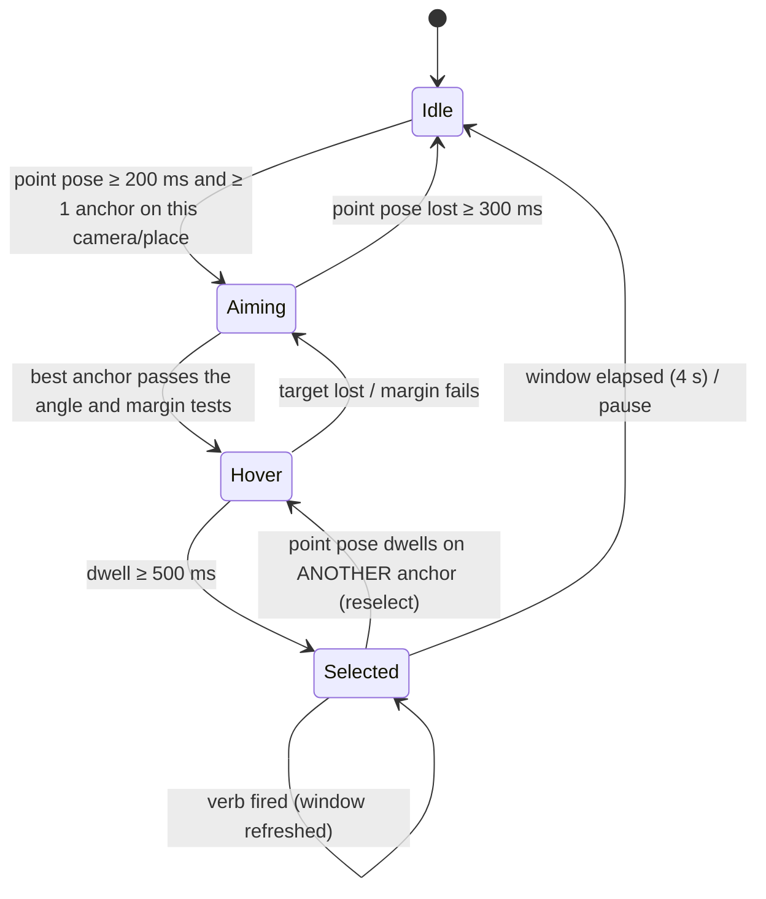

# 09 — Device targeting: teach by pointing, select then act

Crate: `flick-spatial` (new). Depends on `flick-core`, `flick-vision` (hand + face keypoints) and `nalgebra`.
Status: **Core, Phase 1.** Multi-camera anchor fusion is Pro (Phase 3).

## 1. Interaction model

Flick supports two ways to trigger an action:

| Kind | Grammar | Example | When to use |
|---|---|---|---|
| **Global gesture** | `GESTURE → action` | 👍 → toggle living-room lights | A few favourite actions that should be instant |
| **Targeted gesture** | `POINT at device (select) → VERB gesture → action on that device` | point at the ceiling fan → draw a circle → fan on at speed 1 | Many devices, with a small set of reusable verbs |

Why targeted gestures:
- **Scales:** N devices × M verbs without memorizing N × M gestures. A "circle" means "on / more" for every device.
- **Safer:** the selection works like a natural arm step. Targeted verbs never fire without a selection, which cuts false triggers.
- **Natural:** people refer to things by pointing at them.

### 1.1 Canonical example (acceptance test, from the owner's home)

HA entity: `fan.ventilador_dormitorio` ("Ventilador Dormitorio", Tuya ceiling fan).
Observed on 2026-09-28:
- `supported_features: 53` = SET_SPEED | DIRECTION | TURN_OFF | TURN_ON
- `percentage_step: 1.0` (Tuya exposes 100 steps)
- no preset modes; no area assigned

| Step | User does | Flick shows | HA call |
|---|---|---|---|
| 1 | Points the index finger at the ceiling fan and holds ~0.5 s | HUD: fan icon, "Ventilador Dormitorio", the ring fills → **selected** (4 s countdown) | — |
| 2 | Draws a circle with the same index finger | HUD: "Fan → speed 1" | `fan.turn_on` `{"percentage": <level 1>}`, target `fan.ventilador_dormitorio` |
| 3 | Later: points at the fan again, then puts both hands one on top of the other and pulls them apart ("stop") | HUD: "Fan → off" | `fan.turn_off`, target `fan.ventilador_dormitorio` |

- `<level 1>` is taught, not assumed (§5.2). The fan currently reports `percentage: 1` at its lowest speed, so level 1 defaults to `1` until the user captures a different value.
- **Recommendation:** assign the fan to an area (e.g. *Dormitorio*) in HA so pickers can group it. It has none today.

## 2. Selection state machine

One `TargetSelector` per camera (MVP assumption: **one active user per camera**; multi-person association with pose tracking comes in Phase 3).

| Rule | Default | Setting |
|---|---|---|
| **Point pose** (`builtin.point`, geometric; not the canned `pointing_up`, which covers only upward) | Index extended (MCP-PIP-DIP-TIP angles ≥ 160°); middle, ring and pinky curled (tip closer to the wrist than the PIP); thumb ignored. Stable ≥ 200 ms | — |
| Hover test | Angular error θ to the anchor ≤ `tolerance_deg` (10°, grows with anchor uncertainty up to 15°) **and** ≥ 5° margin over the second-best anchor | `targeting.tolerance_deg` |
| Dwell to select | **500 ms** | `targeting.dwell_ms` |
| Selection window | **4 000 ms**, refreshed after every verb (so "circle again" works as a follow-up) | `targeting.window_ms` |
| **Selection lock** | While selected, the selection only changes after a full dwell on another anchor, with the point pose held **and** the ray's angular speed < 60°/s. This way, drawing a circle never reselects | — |
| Ambiguity | Two anchors within the margin → no selection; the HUD shows both names ("Fan or lamp? Hold still") → suppression `ambiguous_target` | — |

## 3. Pointing ray estimation

Coordinate frame: camera frame, meters (x right, y down, z forward). All 3D values are estimates; teaching compensates for systematic bias because the same user and the same camera are used to teach and to point.

1. **Intrinsics:** from a device FOV table shipped in the OTA catalog (MacBook built-in cameras, Continuity Camera, common webcams). Default: 70° horizontal FOV, principal point at the image center.
2. **Hand pose in the camera frame:** `EPnP` + Levenberg–Marquardt refinement between the 21 **world** landmarks (meters, hand-centered) and the 21 **image** landmarks. This gives 3D positions of the index MCP and tip. Cost ≤ 0.2 ms (pure Rust, `nalgebra`).
3. **Ray model**, in priority order:

| Model | Origin → through | Needs | Expected accuracy (verify in P0-08) | Phase |
|---|---|---|---|---|
| **Eye-rooted** (default) | midpoint between the eyes (or the dominant eye, a setting) → index fingertip | Face visible. **BlazeFace short-range** (Apache-2.0, 6 keypoints, ~1 ms) runs **only while the point pose is active**. Eye depth comes from inter-pupillary distance (63 mm default, refined per user from teaching data) | ~5–10° median | 1 |
| **Arm-rooted** | shoulder/elbow → index fingertip | MediaPipe Pose lite (Apache-2.0); for RTSP cameras that see the user from the side or back | ~10–15° | 2 |
| **Finger-only** (fallback) | index MCP → tip | Hand only | ~15–25° | 1 |

4. **Temporal smoothing:** One-Euro filter on origin and direction; during dwell, the ray used for decisions is the median over the last 250 ms.

## 4. Anchors (real device ↔ place in space)

### 4.1 Types

| Kind | Built from | Valid when | Notes |
|---|---|---|---|
| `point3d` (preferred) | ≥ 2 teaching observations from positions ≥ 0.5 m apart | anywhere in the camera's view | Least-squares closest point to all rays; 3×3 covariance from the residuals. If the rays are nearly parallel (< 5° apart), fall back to `direction` |
| `direction` | 1 teaching position | the ray origin is within 0.75 m of the teaching origin | HUD hint: "Taught from the couch only — teach from one more spot to use it anywhere" |
| `region2d` (Phase 2) | the user taps the device on the live preview (when the camera can see it) | anywhere | SAM 2.1 tiny outlines the object; Depth Anything V2 Small gives depth → converted to `point3d`. Setup-time only |

- Anchors belong to a **place** (§6) and a camera.
- Targets can be `entity_id`, `device_id` or `area_id` ("the lamps in this corner" → an area or group).
- **Raw teaching observations are stored**: image and world hand landmarks, eye keypoints, intrinsics version. After an estimator/model update (OTA, `10-…`), anchors are recomputed from them. This is the same principle as ADR-013.
- **Distinctiveness check** after teaching:
  - For every pair of anchors, compute the angular separation seen from each teaching origin.
  - Warn if < 15°: "The fan and the lamp look the same from the couch — teach from where you usually sit, or group them".

### 4.2 Scoring
For each anchor a, with ray origin o and direction d:
- `point3d`: θ = angle(d, a.position − o)
- `direction`: θ = angle(d, a.direction)

Score = exp(−θ² / 2σ²), where σ = max(4°, anchor angular uncertainty seen from o).

## 5. Verbs & action resolution

### 5.1 Targeted mappings
A targeted mapping = (anchor **or** "any selected device of domain X") + verb gesture + optional hand → a **verb action** (`06-…` §4). The dispatcher resolves it against the selected anchor at fire time.

When a device is taught, Flick creates **default verbs** for its domain (editable, can be turned off). The columns map gestures to the verbs `up`, `down`, `stop`, `on`, `off` and a targeted `dial`. The cells show how each verb resolves; `03-…` §6.3 is the normative resolution table.

| Domain | ↻ `circle_cw` | ↺ `circle_ccw` | ✋✋ `two_hand_separate` (stop) | 👍 | 👎 | 🤏 `pinch_dial` |
|---|---|---|---|---|---|---|
| `fan` | **speed level 1** if off; otherwise next level | previous level (turns off below level 1) | `turn_off` | `turn_on` | `turn_off` | `percentage` |
| `light` | on / brighter +20 % | dimmer −20 % | `turn_off` | `turn_on` | `turn_off` | `brightness_pct` |
| `media_player` | volume up | volume down | `media_pause` | `media_play` | `media_pause` | `volume_level` |
| `cover` (non-sensitive) | `open_cover` | `close_cover` | `stop_cover` | `open_cover` | `close_cover` | `position` |
| `switch` / `input_boolean` | `turn_on` | `turn_off` | `turn_off` | `turn_on` | `turn_off` | — |
| `climate` | +0.5° | −0.5° | `turn_off` | `turn_on` | `turn_off` | `temperature` |

The owner's example uses "circle = speed 1". In the fan preset, "any-direction circle = level 1" can be chosen instead of the cw/ccw ladder, and it is **the default when the fan has a single taught level**.

### 5.2 Fan speed levels
- If `100 / percentage_step ≤ 10` (e.g. 3–6 speeds): levels = multiples of `percentage_step`, sent as `fan.turn_on {percentage}`.
- Otherwise (e.g. Tuya with `percentage_step: 1.0`, like `fan.ventilador_dormitorio`), the teach flow asks:
  "Set your fan to speed 1 (remote or HA), then tap **Use current speed**".
  - Flick reads `attributes.percentage` through a targeted `subscribe_entities`.
  - The user repeats this for more levels (optional).
  - Stored as `anchors.verb_params.levels = [1, …]`.
- Next/previous level: computed from the subscribed `percentage` as defined in `03-…` §6.3. If the state is unknown, use `fan.increase_speed` / `fan.decrease_speed`.

### 5.3 Precedence & safety
- While a device is selected, targeted mappings win. Global mappings for the same gesture are suppressed with reason `target_selected`, so an action never fires twice.
- With no selection, targeted mappings never fire (`no_target`).
- The safety policy (`03-…` §7) applies unchanged:
  - Pointing at a lock still needs the global allow setting, `sensitive_ack` and the confirmation gesture.
  - Teaching a sensitive device shows the lock notice.
- `builtin.pointing_up` global mappings fire only when no anchor is hovered. When anchors exist on a camera, the point pose is reserved for targeting.

## 6. Places & "the camera moved"

A laptop moves; RTSP cameras don't. Anchors are only valid while the camera sees the room from the same pose.

- **Place** = camera + scene signature (e.g. "Bedroom desk", "Living room").
  - Scene signature = DINOv2-small (Apache-2.0) global embedding of a downscaled frame, with person/hand regions masked out.
  - It is stored as an embedding, never as an image.
- **Checks:** on camera start, on wake, and every 60 s while active (cost ~10 ms each).
  - Cosine similarity with the current place ≥ 0.90 (tune in P0-08) → OK.
  - Similarity matches another place → switch place silently (HUD: "Living room").
  - Otherwise → anchors become `needs_realign`. Targeting pauses. HUD/notification: "Camera moved — point at 2 devices you taught to re-align".
- **Re-align:**
  1. Flick asks the user to point at 2 known devices by name.
  2. It solves the rotation (Wahba/Kabsch on the directions; translation too with 3 or more).
  3. It applies the transform to all anchors of the place.
  4. If the residual is > 10°, it asks the user to re-teach.

## 7. Teach flow (UI in `04-…` §6b)

1. **Pick the device:** HA entity/device search, sorted by the camera's area. Optional *Suggest devices I can see* (Phase 2, §8).
2. **Point from spot 1:** "Point at the ceiling fan and hold still" → ~1 s capture from the running camera (average of the settled rays, p90 jitter), with live ray feedback. No steady pointing hand → the spot is rejected with a hint.
3. **Point from spot 2:** "Take one or two steps to the side and point again" → triangulate → confidence meter. A third spot is optional.
4. **Speed levels** (fans with fine steps) or **level check** (other domains).
5. **Verbs:** the default verbs for the domain are shown as sentences ("Point + ↻ → speed 1", "Point + ✋✋ apart → off"). The user can edit them or record a custom verb in the Studio.
6. **Test:** "Point at it again" → HUD selection + angular error. "Try a verb" → real call with the result.

**Re-teach** (Devices → Re-teach) runs the same flow for an existing device and replaces its anchor in place: same id, name and verbs, so its mappings keep working.

Target time: **≤ 90 s per device.**

## 8. Setup assistant (Phase 2, optional)
- "Suggest devices I can see", for cameras that can see the devices (typically RTSP; sometimes a laptop facing the room).
  - Local model (on-demand pack): OWLv2 base or Florence-2-base (`11-…` §2) detects "ceiling fan", "lamp", "TV".
  - Candidates are matched to HA entities by domain + name similarity (multilingual: *ventilador* ≈ fan).
  - The user confirms each match. The match gives a `region2d` anchor.
- **Opt-in cloud variant:** a single snapshot sent to an Azure Foundry multimodal model, with the user's own key or Flick Pro (`11-…` §3).
  - Explicit consent screen showing the exact image to be sent.
  - Never automatic.

## 9. Performance budget (M1, p95)

| Stage | Budget |
|---|---|
| Face keypoints (only in point pose) | ≤ 2 ms |
| PnP + ray + scoring (all anchors) | ≤ 0.3 ms |
| Selection latency | dwell 500 ms |
| Point → circle → HA `sent` | ≈ 1.2–2.0 s (a deliberate action; global gestures remain the instant path) |
| Scene signature check | ~10 ms every 60 s |

## 10. Privacy
- Anchors are geometry. Scene signatures are embeddings. Teaching observations are landmarks. **No images are stored.**
- Tap-to-teach uses the live frame in memory only.
- The cloud setup assistant is opt-in, per snapshot, with a preview (`07-…` §4).

## 11. Acceptance tests
They run through the shared replay harness and the nightly metrics (`07-…` §1.2). There is no separate targeting test suite.
- **Fan scenario (replay, one test, two fixtures):** a taught anchor plus
  - `targeting/point_fan_circle.jsonl` (hand landmarks + face keypoints) → **exactly one** `fan.turn_on {percentage: 1}` to `fan.ventilador_dormitorio` via mock HA;
  - `targeting/point_fan_stop.jsonl` → exactly one `fan.turn_off`.
- **Lock (replay):** circling after selection never changes the selection (fixture with two anchors 25° apart).
- **Teach (e2e):** the teach UI flow runs against a fake-landmark engine (`FLICK_FAKE_LANDMARKS`). With no live camera, each spot samples the latest fixture replay instead.
- **Negatives (nightly metric):** the shared negatives replay (`02-…` §8) also asserts **0** targeted actions, since there is no selection without a deliberate point + dwell.
- **Selection accuracy (nightly metric):** P0-08 dataset (≥ 3 people × 5 targets × 3 positions, MacBook camera):
  - ≥ 95 % correct selection for anchors ≥ 20° apart;
  - ≤ 1 % wrong-device selections.
- **Camera moved (manual check, P1-1006):** rotating the laptop lid ±10° → `needs_realign` within 60 s. Re-align with 2 anchors → residual ≤ 5°.
- **OTA recompute:** anchors recomputed after an estimator update move ≤ 5°, or the update is rejected. This is enforced by the pack self-test (`10-…` §5), not a separate test.
